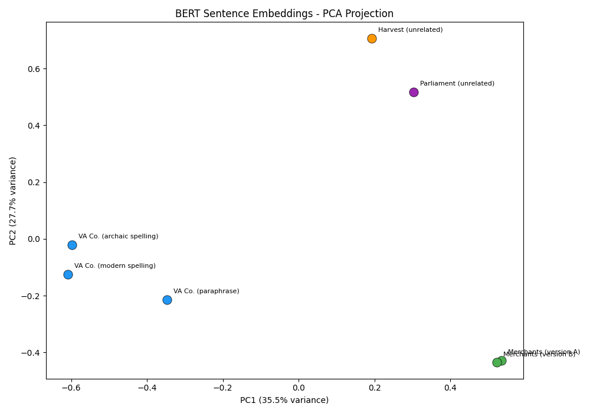
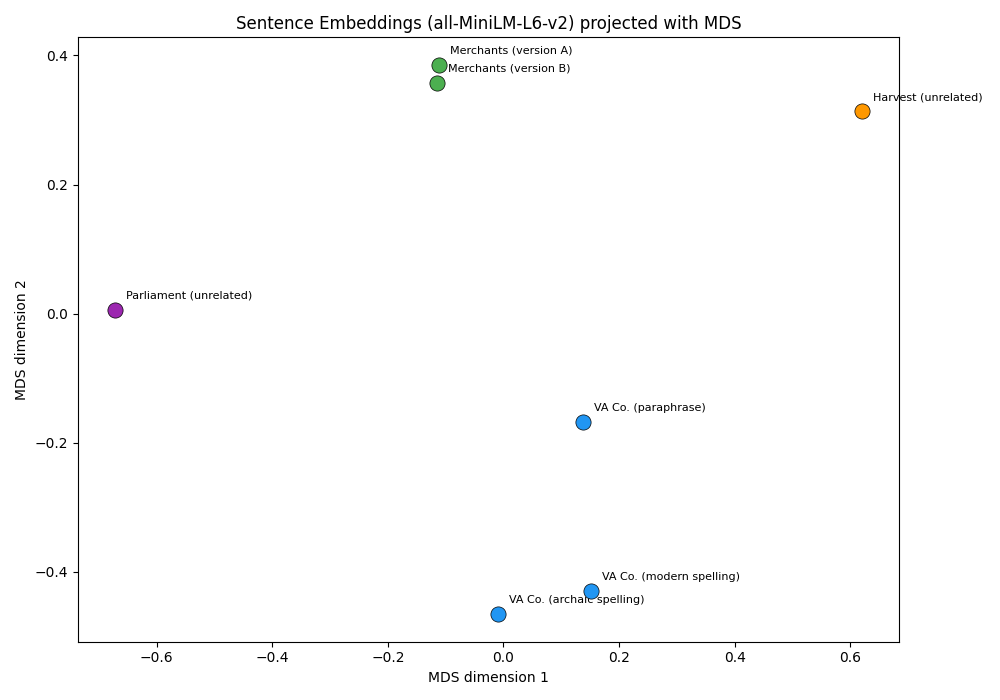

```{r}
#| include: false

library(reticulate)

use_python("C:/Users/astri/miniconda3/envs/tad/python.exe", required = TRUE)
py_config()
```

# Weeks 11-13 goals:

With this tutorial, we are starting a three weeks unit on **BERT** (and BERT-related models). This is how the three weeks will work together:

**Week 11:** this tutorial uses a toy paraphrase corpus to practice tokenization; compare TF-IDF vs. BERT similarity; work with PCA visualization, compare `[CLS]` vs. mean pooling, and understand masked language modeling. We will end with a preview of how base BERT handles Early Modern English (poorly). This will set us up for...

**Week 12:** this is where we learn how to fine-tune the model. We will work with the Geneva Bible (you can find a .xlsx file on [Canvas]{.underline} under "[Weeks 11-13]{.underline}", titled "genevaBible.xlsx" alongside the corpus that we will work with in Week 13) and the tutorail will walk you through the full training loop using HuggingFace's `Trainer`. We will then compare before/after predictions side by side. At the end, we save fine-tuned model for Week 13.

**Week 13:** this is where our hard work pays off. We will work with 626 mercantile `.txt` files, embed them using the fine-tuned model, cluster them with K-Means (with elbow/silhouette analysis for choosing k), and characterizes each cluster with TF-IDF top terms. We will end the tutorial by analyzing the possible meanings of the term "credit" in our corpus. In the 16th and 17th century, the meaning of the term "credit" spanned a wide spectrum, from social values that hinted at honor and trustworthiness to a judgment of economic ability (see the fantastic article by Alexandra Shepard, "Manhood, Credit and Patriarchy in Early Modern England c. 1580-1640" in *Past & Present* (May, 2000), pp. 75-106). In this tutorial, we will work on analyzing these shades of meaning by finding every occurrence, extracting word-level contextual embeddings, clustering them into semantic senses, identifying the most ambiguous borderline cases, and cross-tabulating credit senses against document clusters. We will end with a base-vs-fine-tuned comparison of how the model performs!

Let's get started!

## Week 11: How BERT Reads — From Tokens to Embeddings

At the end of Week 10, I pointed out that [spaCy](https://spacy.io/usage/spacy-101)'s NER model works by building **contextual token embeddings**: numerical representations that capture not just a word's meaning in isolation, but its meaning *in context*. The example we used was "Apple": the word gets a different embedding in "Apple released a new phone" versus "I ate an apple."

Over these two weeks, we are going to build on this idea and we are going to consider how we can leverage this type of representation to compare meaning over time. That is, how can we use contextual embedding when the context is not just a different sentence, but a different century.

We will work with BERT ([[**Bidirectional Encoder Representations from Transformers**]{.underline}](https://arxiv.org/abs/1810.04805)), a model that builds contextual embeddings using a transformer architecture. The key difference from spaCy's default CNN-based embeddings is that BERT uses [**self-attention**](https://arxiv.org/abs/1706.03762): every token's representation is informed by *every other token* in the sentence simultaneously, not just a local window.

Our plan is to:

1.  Understand how BERT tokenizes text (and why it matters)
2.  Extract sentence-level embeddings using BERT
3.  Compare sentence similarity using both TF-IDF and BERT
4.  Visualize embedding spaces with PCA
5.  See what BERT "knows" through masked language modeling

We will work with a small, hand-built toy corpus so that every result is interpretable. Next week, we scale up.

## Part I — From Word2Vec to BERT: The Conceptual Shift

### Static Embeddings vs. Contextual Embeddings

Word2Vec assigns one vector per word type. The word "company" gets a single representation regardless of whether it appears in "the East India Company" or "I enjoy her company." This is a real limitation when words have multiple senses.

BERT assigns **one vector per token occurrence**. The embedding for "company" depends on the surrounding words in that specific sentence. "The East India Company traded spices" and "She was pleasant company at dinner" will produce *different* vectors for the same word.

### How does BERT learn this?

BERT was pre-trained on a massive corpus (Wikipedia + BookCorpus) using two tasks:

1.  Masked Language Modeling (MLM): randomly mask 15% of tokens in a sentence, then predict what the masked tokens were. This forces BERT to build representations that encode the full context of each token.

2.  Next Sentence Prediction: given two sentences, predict whether the second follows the first in the original text.

The result of this training is a model that encodes deep "knowledge" about how English works (I won't always use scare quotes, but obviously a model doesn't "know" anything). We can then extract and use those representations for our own purposes.

### BERT's Architecture (Conceptual)

At a high level, BERT processes text in three stages:

1.  Tokenization → the input sentence is broken into subword tokens using [WordPiece tokenization](https://huggingface.co/learn/llm-course/en/chapter6/6).
2.  Transformer layers → each token passes through a stack of self-attention layers (12 layers in `bert-base`), where each token’s representation is updated based on all other tokens in the sentence.
3.  Output → the final layer produces a 768-dimensional vector for each token, encoding its meaning in context.

These output vectors are the contextual embeddings we will work with.

#### A quick aside:

When a sentence is processed by BERT, the model does not receive the raw sentence directly. Instead, the input sequence is structured like this:

`[CLS] The king ruled England . [SEP]`

Where:

-   **`[CLS]`** → special token marking the start of the sequence

-   **`[SEP]`** → separator token marking the end of the sequence (or separating two sentences)

After tokenization, BERT produces an embedding for every token, including `[CLS]` and `[SEP]`.

#### [BERT-base](https://huggingface.co/papers/1810.04805), [BERT-Large](https://huggingface.co/google-bert/bert-large-cased), [RoBERTa](https://huggingface.co/docs/transformers/en/model_doc/roberta), [ModernBERT](https://huggingface.co/blog/modernbert), [DistilBERT](https://huggingface.co/docs/transformers/en/model_doc/distilbert), [MacBERTh and GysBERT](https://macberth.netlify.app/),.. Oh my!

There are a lot of BERT's and we will talk more about this in our reading for Friday! For this tutorial, we will work with the base model.

## Part II — Setup

**Install Packages:**

You should already have `scikit-learn` and `matplotlib` from previous weeks. We need to add a few new packages:

``` python
#| eval: false

# Run these in your terminal:
# pip install transformers torch sentence-transformers
```

This will take a few minutes: `torch` in particular is a large download. Once this is done, you can verify the installation. Now, create a new file `step0_setup.py`:

``` python
import torch
from transformers import BertTokenizer, BertModel
from sentence_transformers import SentenceTransformer
from sklearn.metrics.pairwise import cosine_similarity
from sklearn.feature_extraction.text import TfidfVectorizer
from sklearn.decomposition import PCA
import numpy as np
import matplotlib.pyplot as plt

print("PyTorch version:", torch.__version__)
print("All imports successful.")
```

## Part III — Our Toy Corpus

Now that we are set up, we can start working with BERT. We will build a small corpus by hand. The sentences are designed to test specific things: paraphrase detection, spelling variation, and semantic similarity across different phrasings.

Create a new file, `step1_tfidf_baseline.py`, we will use this file for the creation of the toy corpus and for Part IV as well, so you will keep adding to it until we finish TF-IDF similarity. Start by creating two lists which we will name `sentences` and `labels`:

``` python
sentences = [
    # Group 1: Virginia Company — same content, different phrasing/spelling
    "The Virginia Companie did advance traffique beyond the seas.",
    "The Virginia Company did advance traffic beyond the seas.",
    "The Virginia Company promoted overseas trade.",
    
    # Group 2: Merchant activity
    "The merchants of London traded in silks and spices.",
    "London merchants engaged in the silk and spice trade.",
    
    # Group 3: Unrelated (control)
    "The harvest was plentiful this year.",
    "Parliament assembled to debate the new taxation.",
]

# Labels for reference
labels = [
    "VA Co. (archaic spelling)",
    "VA Co. (modern spelling)",
    "VA Co. (paraphrase)",
    "Merchants (version A)",
    "Merchants (version B)",
    "Harvest (unrelated)",
    "Parliament (unrelated)",
]
```

Take a moment to think about what you *expect* given your experience in this class so far:

-   Sentences 0, 1, and 2 say the same thing. Should their similarity be high?
-   Sentences 3 and 4 are paraphrases of each other.
-   Sentences 5 and 6 are about completely different topics.

## Part IV — Baseline: TF-IDF Similarity

Before we use BERT, let's establish a baseline with TF-IDF. This represents each sentence as a sparse vector of word frequencies, weighted by how distinctive each word is. The next block of code will do the following four things:

1.  Turn the sentences into TF-IDF vectors

2.  Compute cosine similarity between every pair of sentences

3.  Create a similarity matrix

4.  Print the matrix in a human-readable labeled table

``` python
vectorizer = TfidfVectorizer()
tfidf_matrix = vectorizer.fit_transform(sentences)

tfidf_sim = cosine_similarity(tfidf_matrix)

# Display as a formatted table
print("TF-IDF Cosine Similarity Matrix:\n")
print(f"{'':>30s}", end="")
for i in range(len(sentences)):
    print(f"  [{i}]", end="")
print()

for i in range(len(sentences)):
    print(f"{labels[i]:>30s}", end="")
    for j in range(len(sentences)):
        print(f" {tfidf_sim[i][j]:5.2f}", end="")
    print()
```

Your output should look like:

`TF-IDF Cosine Similarity Matrix:`

```         
                            [0]   [1]   [2]   [3]   [4]   [5]   [6]
 VA Co. (archaic spelling)  1.00  0.68  0.17  0.05  0.06  0.06  0.06
  VA Co. (modern spelling)  0.68  1.00  0.32  0.06  0.06  0.06  0.06
       VA Co. (paraphrase)  0.17  0.32  1.00  0.03  0.17  0.04  0.04
     Merchants (version A)  0.05  0.06  0.03  1.00  0.43  0.03  0.03
     Merchants (version B)  0.06  0.06  0.17  0.43  1.00  0.03  0.03
       Harvest (unrelated)  0.06  0.06  0.04  0.03  0.03  1.00  0.03
    Parliament (unrelated)  0.06  0.06  0.04  0.03  0.03  0.03  1.00
```

Look at the TF-IDF similarity between sentences 0 and 2 ("The Virginia Companie did advance traffique beyond the seas" vs. "The Virginia Company promoted overseas trade"). These sentences mean the same thing, but because they use mostly different words, TF-IDF gives them a relatively low similarity score.

Also look at sentences 0 and 1: the only difference is spelling ("Companie" → "Company", "traffique" → "traffic"), but TF-IDF treats these as completely different tokens. This is a fundamental limitation of bag-of-words methods for historical text.

## Part V — BERT Sentence Embeddings

Now let's see how BERT handles the same sentences. We will use `sentence-transformers`, which wraps a BERT-based model optimized for computing sentence similarity.

### How do we select a model?

The most systematic comparison of embedding models today is the MTEB leaderboard.

It's a benchmark created by Hugging Face researchers. It evaluates sentence-embedding models across 50+ tasks, including (of interest to us):

-   semantic similarity

-   clustering

-   classification

I find the MTEB table to be overwhelming when I am looking for models with specific strengths. My best advice is to search scholarly reviews of models by specific tasks (like [this one](https://arxiv.org/abs/1908.10084) or [this one](https://arxiv.org/abs/1908.10084)) and if I see that a couple of models perform well on the tasks I am interested in, then I loop back to the MTEB table for more information.

Now, create a new file : `step2_bert_similarity.py`.

``` python
from sentence_transformers import SentenceTransformer
from sklearn.metrics.pairwise import cosine_similarity

sentences = [
    "The Virginia Companie did advance traffique beyond the seas.",
    "The Virginia Company did advance traffic beyond the seas.",
    "The Virginia Company promoted overseas trade.",
    "The merchants of London traded in silks and spices.",
    "London merchants engaged in the silk and spice trade.",
    "The harvest was plentiful this year.",
    "Parliament assembled to debate the new taxation.",
]

labels = [
    "VA Co. (archaic spelling)",
    "VA Co. (modern spelling)",
    "VA Co. (paraphrase)",
    "Merchants (version A)",
    "Merchants (version B)",
    "Harvest (unrelated)",
    "Parliament (unrelated)",
]

# Load a sentence-transformer model
# all-MiniLM-L6-v2 is a lightweight, fast model good for similarity tasks
model = SentenceTransformer("all-MiniLM-L6-v2")

# Encode all sentences into 384-dimensional vectors
embeddings = model.encode(sentences)

print(f"Embedding shape: {embeddings.shape}")
print(f"Each sentence is now a vector of {embeddings.shape[1]} numbers.\n")

# Compute BERT-based similarity
bert_sim = cosine_similarity(embeddings)

print("BERT Cosine Similarity Matrix:\n")
print(f"{'':>30s}", end="")
for i in range(len(sentences)):
    print(f"  [{i}]", end="")
print()

for i in range(len(sentences)):
    print(f"{labels[i]:>30s}", end="")
    for j in range(len(sentences)):
        print(f" {bert_sim[i][j]:5.2f}", end="")
    print()
```

Note: you will get a warning message about a parameter called `embeddings.position_ids` . You can safely ignore this, it's just part of saving the model. You can see that the embedding correctly encoded the 7 sentences as 384-dimensional vectors.

You will also get a BERT Cosine Similarity Matrix that looks like this:

```         
                            [0]   [1]   [2]   [3]   [4]   [5]  [6]
 VA Co. (archaic spelling)  1.00  0.76  0.58  0.19  0.19  0.10  0.11
  VA Co. (modern spelling)  0.76  1.00  0.66  0.21  0.23  0.05  0.07
       VA Co. (paraphrase)  0.58  0.66  1.00  0.39  0.41  0.14  0.08
     Merchants (version A)  0.19  0.21  0.39  1.00  0.95  0.13  0.19
     Merchants (version B)  0.19  0.23  0.41  0.95  1.00  0.12  0.19
       Harvest (unrelated)  0.10  0.05  0.14  0.13  0.12  1.00  0.06
    Parliament (unrelated)  0.11  0.07  0.08  0.19  0.19  0.06  1.00
```

### What to notice

Compare these numbers to the TF-IDF matrix:

-   **Paraphrase detection**: sentences 0, 1, and 2 now show a higher similarity, because BERT recognizes that "advance traffique beyond the seas" and "promoted overseas trade" mean the same thing.
-   **Spelling robustness**: "Companie" vs. "Company" matter much to BERT than to TF-IDF.
-   **Semantic grouping**: sentences 3 and 4 (the merchant pair) are now [very]{.underline} similar, and both are closer to the Virginia Company sentences (all about trade) than to sentence 5 (harvest) or 6 (Parliament).

------------------------------------------------------------------------

## Part VI — Side-by-Side: The Virginia Company Trio

Let's isolate the three Virginia Company sentences to really see the difference between TF-IDF and BERT. Create a new file: `python step3_trio_comparison.py`.

``` python
rom sentence_transformers import SentenceTransformer
from sklearn.feature_extraction.text import TfidfVectorizer
from sklearn.metrics.pairwise import cosine_similarity

# --- The Virginia Company trio ---
trio = [
    "The Virginia Companie did advance traffique beyond the seas.",
    "The Virginia Company did advance traffic beyond the seas.",
    "The Virginia Company promoted overseas trade."
]
trio_labels = ["Archaic spelling", "Modern spelling", "Paraphrase"]

# --- TF-IDF ---
vectorizer = TfidfVectorizer()
tfidf_trio = vectorizer.fit_transform(trio)
tfidf_trio_sim = cosine_similarity(tfidf_trio)

# --- BERT ---
print("Loading model...")
model = SentenceTransformer("all-MiniLM-L6-v2")
bert_trio = model.encode(trio)
bert_trio_sim = cosine_similarity(bert_trio)

# --- Compare ---
print("\n=== Virginia Company Trio ===\n")

print("TF-IDF Similarity:")
for i in range(3):
    for j in range(3):
        print(f"  {trio_labels[i]:20s} <-> {trio_labels[j]:20s} : {tfidf_trio_sim[i][j]:.3f}")
    print()

print("BERT Similarity:")
for i in range(3):
    for j in range(3):
        print(f"  {trio_labels[i]:20s} <-> {trio_labels[j]:20s} : {bert_trio_sim[i][j]:.3f}")
    print()
```

**TF-IDF Cosine Similarity**

|                      | Archaic spelling | Modern spelling | Paraphrase |
|----------------------|------------------|-----------------|------------|
| **Archaic spelling** | 1.000            | 0.694           | 0.206      |
| **Modern spelling**  | 0.694            | 1.000           | 0.331      |
| **Paraphrase**       | 0.206            | 0.331           | 1.000      |

**BERT Similarity**

|                      | Archaic spelling | Modern spelling | Paraphrase |
|----------------------|------------------|-----------------|------------|
| **Archaic spelling** | 1.000            | 0.757           | 0.579      |
| **Modern spelling**  | 0.757            | 1.000           | 0.658      |
| **Paraphrase**       | 0.579            | 0.658           | 1.000      |

Earlier in the semester, we compared documents using token-level features such as word counts or TF-IDF weights. BERT-based embeddings move beyond individual words and instead represent the overall meaning of a sentence, allowing the model to recognize similarity even when the wording changes. For historical text, where spelling varies, vocabulary changes, and meaning persists, this distinction is crucial.

## Part VII — Visualizing the Embedding Space (PCA & MDS)

To help us understand a bit better this toy corpus of 7 sentences, it would be helpful to visualize how each of them is represented as a vector. Obviously, we can plot in 384 dimensions, so we will need to do dimension reduction.

First, we will use [[**PCA**]{.underline}](https://www.youtube.com/watch?v=FgakZw6K1QQ) (Principal Component Analysis) to project the vectors into 2D and see how BERT organizes them spatially. PCA finds the directions in the embedding space that capture the largest variance in the data and projects the points onto those directions. This means that PCA preserves **the overall structure** of the embedding vectors, not the pairwise similarity relationships.

So, you will want to use PCA when you want to:

-   Get a quick overview of the embedding space

-   Identify major directions of variation in the data

-   Produce a fast, deterministic projection of vectors

It also works well with larger datasets, though this is not the case here.

Now, create a new file: `step4_visualize_pca.py` :

``` python
from sentence_transformers import SentenceTransformer
from sklearn.decomposition import PCA
from sklearn.metrics.pairwise import cosine_similarity
import matplotlib.pyplot as plt
import numpy as np

# --- Same toy corpus ---
sentences = [
    "The Virginia Companie did advance traffique beyond the seas.",
    "The Virginia Company did advance traffic beyond the seas.",
    "The Virginia Company promoted overseas trade.",
    "The merchants of London traded in silks and spices.",
    "London merchants engaged in the silk and spice trade.",
    "The harvest was plentiful this year.",
    "Parliament assembled to debate the new taxation.",
]

labels = [
    "VA Co. (archaic spelling)",
    "VA Co. (modern spelling)",
    "VA Co. (paraphrase)",
    "Merchants (version A)",
    "Merchants (version B)",
    "Harvest (unrelated)",
    "Parliament (unrelated)",
]

# --- Embed ---
print("Loading model and embedding sentences...")
model = SentenceTransformer("all-MiniLM-L6-v2")
embeddings = model.encode(sentences)

# --- PCA ---
pca = PCA(n_components=2)
reduced = pca.fit_transform(embeddings)

print(f"Variance explained: PC1={pca.explained_variance_ratio_[0]:.1%}, "
      f"PC2={pca.explained_variance_ratio_[1]:.1%}")

# --- Plot ---
# Colors by semantic group
group_colors = ["#2196F3", "#2196F3", "#2196F3",   # VA Company (blue)
                "#4CAF50", "#4CAF50",                # Merchants (green)
                "#FF9800",                           # Harvest (orange)
                "#9C27B0"]                           # Parliament (purple)

fig, ax = plt.subplots(figsize=(10, 7))

for i in range(len(reduced)):
    ax.scatter(reduced[i, 0], reduced[i, 1],
               c=group_colors[i], s=120, zorder=5, edgecolors="black", linewidths=0.5)
    ax.annotate(labels[i], (reduced[i, 0], reduced[i, 1]),
                textcoords="offset points", xytext=(8, 8), fontsize=8)

ax.set_xlabel(f"PC1 ({pca.explained_variance_ratio_[0]:.1%} variance)")
ax.set_ylabel(f"PC2 ({pca.explained_variance_ratio_[1]:.1%} variance)")
ax.set_title("BERT Sentence Embeddings - PCA Projection")

plt.tight_layout()
plt.savefig("pca_toy_corpus.png", dpi=150, bbox_inches="tight")
plt.show()

print("\nSaved plot to pca_toy_corpus.png")
print("\n--- What to look for ---")
print("- The three VA Company sentences (blue) should cluster together.")
print("- The two merchant sentences (green) should cluster together.")
print("- Harvest (orange) and Parliament (purple) should be further away.")
```



As we would expect if the

-   The three Virginia Company sentences (the blue dots on the left) cluster together.
-   The two merchant sentences (the green dots in the lower right corner) cluster very close together.
-   The harvest and Parliament sentences are further away from the trade-related cluster.
-   Within the VA Company cluster, BERT did a great job of handling the archaic and modern spelling, keeping them quite close to each other.

Because PCA is a linear projection, it is also easy to interpret and computationally very stable.

**However**, you want to be careful with PCA: two sentences that are very similar in cosine space may not appear close together in the PCA projection because PCA is not designed to preserve pairwise distances.

Our other option is [[**MDS**]{.underline}](https://www.youtube.com/watch?v=GEn-_dAyYME) (Multidimensional Scaling) with cosine distance. MDS starts from a distance matrix (for example cosine distance between embeddings) and places points in 2D so that the distances between points are preserved as closely as possible. This is useful for us because MDS will preserve the semantic similarity relationship between our sentences.

So, you will want to use PCA when you want to:

-   Visualize semantic similarity relationships
-   Preserve cosine similarity structure
-   Show clusters of related sentences.

However, while this is not a problem for our toy corpus, MDS becomes impractical with larger corpora. This is because MDS operates on an $n^2$ distance matrix, which can grow out of control quickly. I would avoid using MDS with anything more than 200 documents. [Remember]{.underline}: we are embedding documents as a unit (that is, one document = one vector), so the length of the document doesn't matter here.

PCA scales better to larger corpora, because it projects the embedding vectors without computing the full distance matrix.

Create a new file `step4_visualize_mds.py` :

``` Python
from sentence_transformers import SentenceTransformer
from sklearn.metrics.pairwise import cosine_distances
from sklearn.manifold import MDS
import matplotlib.pyplot as plt

sentences = [
    "The Virginia Companie did advance traffique beyond the seas.",
    "The Virginia Company did advance traffic beyond the seas.",
    "The Virginia Company promoted overseas trade.",
    "The merchants of London traded in silks and spices.",
    "London merchants engaged in the silk and spice trade.",
    "The harvest was plentiful this year.",
    "Parliament assembled to debate the new taxation.",
]

labels = [
    "VA Co. (archaic spelling)",
    "VA Co. (modern spelling)",
    "VA Co. (paraphrase)",
    "Merchants (version A)",
    "Merchants (version B)",
    "Harvest (unrelated)",
    "Parliament (unrelated)",
]

group_colors = [
    "#2196F3", "#2196F3", "#2196F3",
    "#4CAF50", "#4CAF50",
    "#FF9800",
    "#9C27B0"
]

print("Loading model and embedding sentences...")
model = SentenceTransformer("all-MiniLM-L6-v2")
embeddings = model.encode(sentences, normalize_embeddings=True)

# Cosine distance matrix
dist_matrix = cosine_distances(embeddings)

# 2D projection that tries to preserve pairwise distances
mds = MDS(
    n_components=2,
    dissimilarity="precomputed",
    random_state=42,
    metric=True
)
reduced = mds.fit_transform(dist_matrix)

fig, ax = plt.subplots(figsize=(10, 7))

for i in range(len(reduced)):
    ax.scatter(
        reduced[i, 0], reduced[i, 1],
        c=group_colors[i], s=120,
        edgecolors="black", linewidths=0.5, zorder=5
    )
    ax.annotate(
        labels[i],
        (reduced[i, 0], reduced[i, 1]),
        textcoords="offset points",
        xytext=(8, 8),
        fontsize=8
    )

ax.set_xlabel("MDS dimension 1")
ax.set_ylabel("MDS dimension 2")
ax.set_title("Sentence Embeddings (all-MiniLM-L6-v2) projected with MDS")

plt.tight_layout()
plt.savefig("mds_toy_corpus.png", dpi=150, bbox_inches="tight")
plt.show()
```

Once you run the code, you should see:



**Question for the reader:** why do you think the MDS visualization looks this way?

## Part VIII — Semantic Search (Retrieval)

-   Create file: `step5_semantic_search.py` — the retrieval/search demo (Part VIII)

One practical application of sentence embeddings is semantic search: given a query, find the most similar sentence in a corpus.
