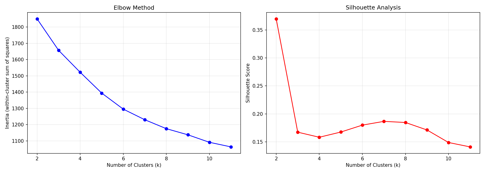
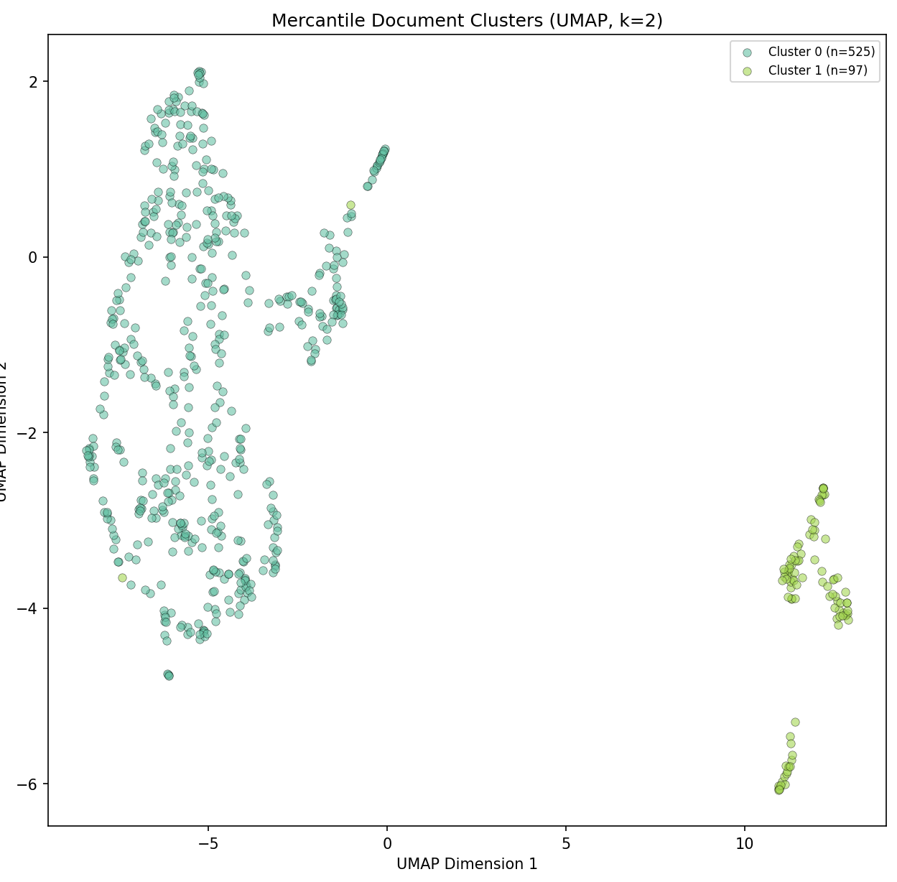
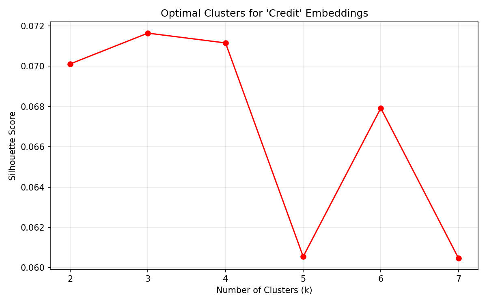
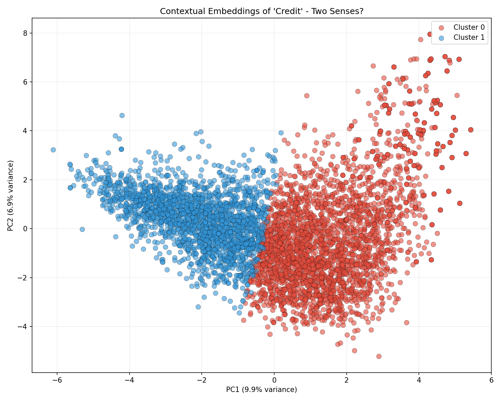
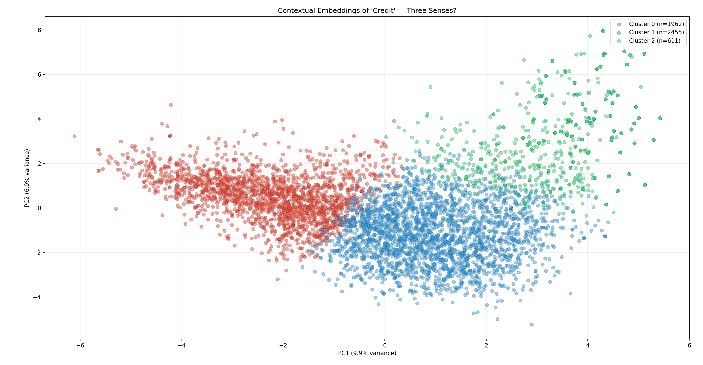
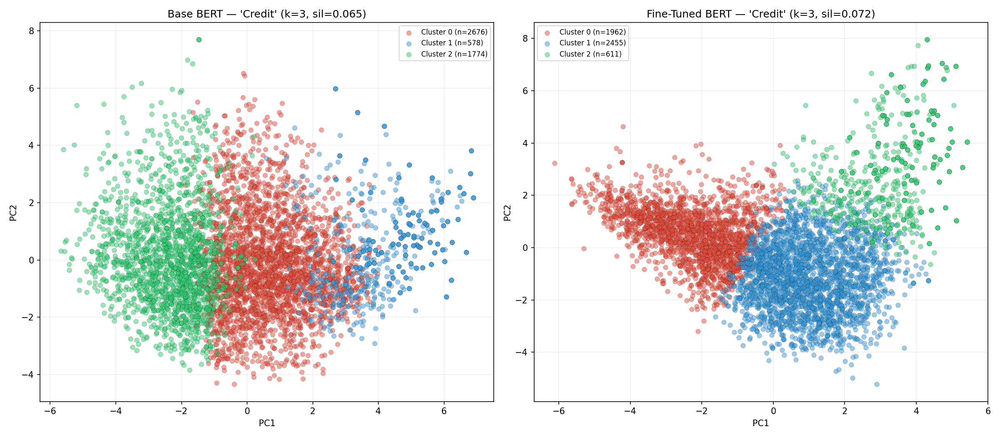
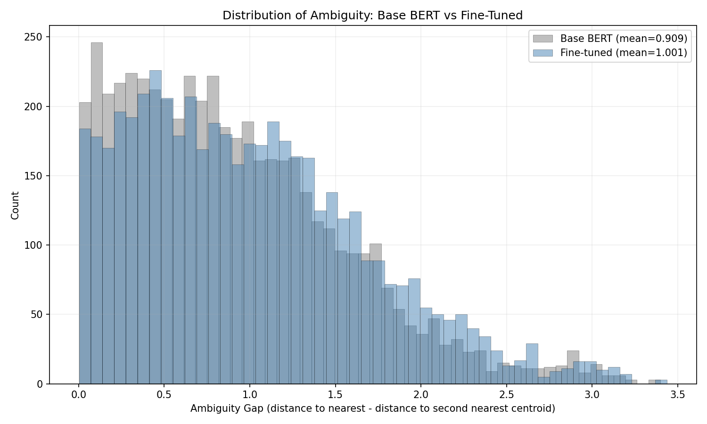

```{r}
#| include: false

library(reticulate)

use_python("C:/Users/astri/miniconda3/envs/tad/python.exe", required = TRUE)
py_config()
```

## Week 13 goals:

To recap what we have been doing for this sequence of tutorials: first, we learned how BERT produces contextual embeddings (Week 11); and, second, we fine-tuned BERT on the Geneva Bible to teach it Early Modern English (Week 12). With this last tutorial, we will put that toolkit to use on a real historical archive.

We (well, I) have 626 mercantile documents from the early modern period. We are going to:

1.  **Cluster** the documents to discover what kinds of texts the archive contains
2.  Investigate the word **"credit"** across the corpus, asking: in which documents does "credit" mean *social reputation and trustworthiness*, and in which does it mean *a financial instrument or debt*? In the overview section of Week 11, I linked to the work of Alexandra Shepard for those of you interested in the historical context. The goal of this tutorial is to see if BERT can help us trace these interconnected meanings of "credit."

Our plan is to:

1.  Embed documents using the fine-tuned BERT model from Week 12
2.  Cluster embeddings and interpret the results
3.  Extract word-level contextual embeddings from specific passages
4.  Analyze how the same word carries different meanings across a corpus

Let's get started on this very last tutorial!

### Two warnings:

-   **Step 1** will take a while to run: consider setting the process up before you are going to do something else (like cook dinner) and then letting it run.

-   **Corpus**: I have a (very slightly) different corpus than you do. I have a reason for doing this: as the analysis progresses, you will need to compare my results and interpretations with yours. The differences are minor, but I want you to pay attention to see if small changes in the corpus produce major differences in the analysis.

## Step 0 — Setup, Data and Model Loading

We use the model we saved last week. If some tragedy happened along the way and you no longer have the tutorial saved, you can also use base BERT. The tutorial will still work, but the embeddings will be (slightly) less attuned to Early Modern English.

Make sure that the files are in a folder called "texts" (or change the path in the code). **Quick reminder:** you have a slightly different set of texts from the ones that I have, so our results won't match exactly!

-   In the terminal, install `umap-learn`: `pip install umap-learn` . We will use `umap-learn` to visualize our clusters.

Create a new file, `step0_setup_and_load.py`, and run it:

``` python
import torch
import numpy as np
from pathlib import Path
from transformers import BertTokenizer, BertModel

#Load the fine-tuned model
MODEL_PATH = "geneva-bert"

try:
    tokenizer = BertTokenizer.from_pretrained(MODEL_PATH)
    model = BertModel.from_pretrained(MODEL_PATH)
    print(f"Loaded fine-tuned model from {MODEL_PATH}")
except Exception:
    tokenizer = BertTokenizer.from_pretrained("bert-base-uncased")
    model = BertModel.from_pretrained("bert-base-uncased")
    print("Fine-tuned model not found. Using base BERT instead.")
    print("(Results will be less accurate for Early Modern English.)")

model.eval()
device = "cuda" if torch.cuda.is_available() else "cpu"
model.to(device)
print(f"Using device: {device}")

# Load texts
TEXT_DIR = Path("texts")

documents = []
for path in sorted(TEXT_DIR.glob("*.txt")):
    with open(path, "r", encoding="utf-8", errors="ignore") as f:
        text = f.read().strip()
    if len(text) > 50:
        documents.append({
            "filename": path.name,  # record the filename
            "text": text,
            "word_count": len(text.split()),
        })

print(f"\nLoaded {len(documents)} documents from {TEXT_DIR}")
print(f"Total words: {sum(d['word_count'] for d in documents):,}")
print(f"Average document length: {np.mean([d['word_count'] for d in documents]):.0f} words")
print(f"Shortest: {min(d['word_count'] for d in documents)} words")
print(f"Longest: {max(d['word_count'] for d in documents)} words")

# --- Preview ---
print("\n=== Sample Documents ===\n")
for doc in documents[:3]:
    print(f"[{doc['filename']}] ({doc['word_count']} words)")
    print(f"  {doc['text'][:200]}...")
    print()

print(f"Setup complete. {len(documents)} documents ready for analysis.")
```

### Aside:

You will get a number of warning messages. They are not a problem. The saved model from Week 12, `geneva-bert`, was fine-tuned for masked language modeling (MLM), which doesn't use BERT's pooler. If you want to dig deeper into the pooler, [**this**](https://gmihaila.github.io/tutorial_notebooks/bert_inner_workings/) is the best, [readily-available]{.underline} explanation that I have found. The upshot is that MLM doesn't need pooler, so it wasn't saved at the end of Week 12. When you load those weights into a standard BertModel (which does define a pooler layer), the loader notices those two parameters have no matching weights in the checkpoint, so it initializes them randomly and flags them as "MISSING." Since we are using this model to analyze word embeddings and semantic meaning, this is not a problem. The weights simply won't be used in our workflow.

## Step 1: Embed the Documents

To cluster the documents, we need to represent each one as a single vector. Since most documents are longer than BERT's 512-token limit (the shortest one in *my* set has 202 words and the longest one has over a million!), we use a **chunking and averaging** strategy:

1.  Split each document into [overlapping]{.underline} chunks of \~512 tokens
2.  Embed each chunk separately
3.  We then use [mean pooling](https://arxiv.org/html/2411.14654v1) within each chunk (over token embeddings)
4.  Length-weighted averaging across chunks: length-weighting means that longer chunks contribute more to the final document embedding than very short leftover chunks at the end.

**Some details:** Within each chunk, we use mean pooling over the token embeddings in the final hidden layer. This gives us a single vector that summarizes that [chunk’s contextual meaning]{.underline}. We exclude the special `[CLS]` and `[SEP]` tokens before averaging, since our goal is to represent the actual chunk text rather than those structural markers.To create one embedding for the full document, we then combine the chunk embeddings using a length-weighted average.

**Why overlap?** Chunk boundaries are created in token space, which means that important phrases or sentences can fall near the edge of a chunk and lose some context if they are split. By overlapping, we reduce that risk: material near the end of one chunk reappears near the beginning of the next, making it more likely that meaningful passages are represented with adequate context in at least one chunk.

Create a new file, `step1_embed_documents.py`, and run it. This step takes [**longer**]{.underline} since we are embedding our full corpus (go ahead grab a snack or even consider running it while you are doing homework for another class or, if you are like me, while you make dinner...).

**An aside:** If you have a good CUDA GPU on your machine, the code is going to be slow because it feeds the GPU one chunk at a time. I wrote it this way because I don't know your machine and I need to make sure that everyone can run the tutorial.

``` python
import json
from pathlib import Path

import numpy as np
import torch
from transformers import BertModel, BertTokenizer

# Configuration

MODEL_PATH = "geneva-bert"
FALLBACK_MODEL = "bert-base-uncased"
TEXT_DIR = Path("texts")
OUTPUT_DIR = Path("data")
OUTPUT_FILE = OUTPUT_DIR / "doc_embeddings.json"

MAX_LENGTH = 512          # BERT maximum input length
STRIDE = 256              # overlap step
MIN_TOKENS = 10           # ignore small leftover chunks
MIN_CHARS = 50            # ignore extremely short documents

# Device setup

device = torch.device("cuda" if torch.cuda.is_available() else "cpu")
print(f"Using device: {device}")

# Load tokenizer and model

def load_model_and_tokenizer(model_path, fallback_model):
    """
    Try to load the fine-tuned model. If that fails, fall back to base BERT.
    """
    try:
        tokenizer = BertTokenizer.from_pretrained(model_path)
        model = BertModel.from_pretrained(model_path)
        print(f"Loaded fine-tuned model from '{model_path}'")
    except Exception as e:
        print(f"Could not load '{model_path}': {e}")
        print(f"Falling back to '{fallback_model}'")
        tokenizer = BertTokenizer.from_pretrained(fallback_model)
        model = BertModel.from_pretrained(fallback_model)

    model.to(device)
    model.eval()
    return tokenizer, model

# Load text files

def load_documents(text_dir, min_chars=50):
    """
    Load .txt documents from a folder.
    Returns a list of dictionaries with filename and text.
    """
    documents = []

    for path in sorted(text_dir.glob("*.txt")):
        with open(path, "r", encoding="utf-8", errors="ignore") as f:
            text = f.read().strip()

        if len(text) >= min_chars:
            documents.append({
                "filename": path.name,
                "text": text
            })

    return documents


# Create overlapping token chunks

def chunk_token_ids(token_ids, max_length=512, stride=256, min_tokens=10):
  
    chunk_token_limit = max_length - 2
    chunks = []

    for start in range(0, len(token_ids), stride):
        chunk = token_ids[start:start + chunk_token_limit]
        if len(chunk) >= min_tokens:
            chunks.append(chunk)

    return chunks


# Embed a single chunk

def embed_chunk(chunk_token_ids, tokenizer, model):

    input_ids_list = [tokenizer.cls_token_id] + chunk_token_ids + [tokenizer.sep_token_id]

    input_ids = torch.tensor([input_ids_list], dtype=torch.long, device=device)
    attention_mask = torch.ones_like(input_ids, device=device)

    with torch.no_grad():
        outputs = model(input_ids=input_ids, attention_mask=attention_mask)

    # Shape: [1, seq_len, hidden_dim]
    last_hidden = outputs.last_hidden_state

    # Exclude [CLS] and [SEP]
    token_embeddings = last_hidden[0, 1:-1, :]

    # Mean pooling across tokens in this chunk
    chunk_embedding = token_embeddings.mean(dim=0).cpu().numpy()

    return chunk_embedding

# Embed a full document

def embed_document(text, tokenizer, model, max_length=512, stride=256, min_tokens=10):
    """
    Embed one long document by:
      1. tokenizing the full document,
      2. splitting into overlapping chunks,
      3. embedding each chunk,
      4. combining chunk embeddings with a length-weighted average.
    """
    ###### IMPORTANT:
    # We use tokenizer.tokenize(...) + convert_tokens_to_ids(...)
    # instead of tokenizer.encode(...), because encode(...) can produce
    # a warning when the full document is longer than 512 tokens.
    #
    # Here we are *not* sending the full document to BERT. We are only
    # tokenizing it first, then chunking it manually.
    tokens = tokenizer.tokenize(text)
    token_ids = tokenizer.convert_tokens_to_ids(tokens)

    if len(token_ids) == 0:
        return None

    chunks = chunk_token_ids(
        token_ids,
        max_length=max_length,
        stride=stride,
        min_tokens=min_tokens
    )

    if not chunks:
        return None

    chunk_embeddings = []
    chunk_weights = []

    for chunk in chunks:
        chunk_embedding = embed_chunk(chunk, tokenizer, model)
        chunk_embeddings.append(chunk_embedding)
        chunk_weights.append(len(chunk))  # length-weight the final average

    document_embedding = np.average(
        np.array(chunk_embeddings),
        axis=0,
        weights=np.array(chunk_weights)
    )

    return document_embedding

####
# Main pipeline. SEE [1] below

def main():
    tokenizer, model = load_model_and_tokenizer(MODEL_PATH, FALLBACK_MODEL)

    documents = load_documents(TEXT_DIR, min_chars=MIN_CHARS)
    print(f"Loaded {len(documents)} documents.\n")

    print("Embedding documents (this will take a while)...\n")

    doc_embeddings = []
    doc_filenames = []

    for i, doc in enumerate(documents, start=1):
        embedding = embed_document(
            doc["text"],
            tokenizer,
            model,
            max_length=MAX_LENGTH,
            stride=STRIDE,
            min_tokens=MIN_TOKENS
        )

        if embedding is not None:
            doc_embeddings.append(embedding.tolist())
            doc_filenames.append(doc["filename"])

        if i % 50 == 0 or i == len(documents):
            print(f"Processed {i}/{len(documents)} documents...")

    if not doc_embeddings:
        print("No embeddings were created.")
        return

    print(f"\nSuccessfully embedded {len(doc_embeddings)} documents.")
    print(f"Embedding dimensionality: {len(doc_embeddings[0])}")

    OUTPUT_DIR.mkdir(exist_ok=True)

    output = {
        "filenames": doc_filenames,
        "embeddings": doc_embeddings
    }

    with open(OUTPUT_FILE, "w", encoding="utf-8") as f:
        json.dump(output, f)

    print(f"Saved to {OUTPUT_FILE}")


if __name__ == "__main__":
    main()
```

\[1\] At a high level, this loop turns each document into a single vector:

-   document → tokens → overlapping chunks → chunk embeddings → document embedding

The final vector reflects the document's dominant themes by aggregating information across all chunks, with longer sections contributing more than very short ones (via length-weighted averaging). These document-level embeddings can then be used for clustering...

## Step 2: Document Clustering

Now we cluster the documents to see what structure BERT discovers in the archive. We will use K-Means clustering and visualize the results with UMAP (or PCA as a fallback).

### Choosing the Number of Clusters

We will try several values of k and use the **elbow method** and [**silhouette scores**](https://scikit-learn.org/stable/auto_examples/cluster/plot_kmeans_silhouette_analysis.html) to pick a good number \[[**this explanation**](https://uc-r.github.io/kmeans_clustering) is helpful for k-means, even if the code is in R (which is standard for statistical work and with which you should be familiar from the first part of the semester)\].

-   The **elbow plot** should help us decide how many clusters to use by showing how much we improve as we add more clusters. On the x-axis, we will plot the number of clusters (k) and on the y-axis we will plot *inertia.* Inertia measures how tightly grouped the points are inside each cluster. This means that lower inertia = tighter, more compact clusters. You are looking for a bend (“elbow”) in the curve. The idea is that, at first, adding clusters gives big improvements in how compact the clusters are. However, the improvements slow down after a certain number of clusters. The point where this change happens is called the “elbow.” The problem is that sometimes the curve will look fairly smooth, without a clear elbow. The elbow method does not measure separation between clusters — only compactness.

-   The **silhouette score** tells us how well-separated and well-formed the clusters are. When we plot it, on the x-axis, we will have the number of clusters (k), while on the y-axis we will have the silhouette score. For each point *p*, it compare how close *p* is to points in its own cluster vs. how close *p* is to points in other clusters. Unlike the elbow method, silhouette explicitly measures cluster separation, not just compactness. The image below (created with the help of Claude), show you how to understand the Silhouette score. While I added the formula too, you want to focus on the image to develop your understanding ([wikipedia](https://en.wikipedia.org/wiki/Silhouette_(clustering)) has clear explanation too):

    .png)

The elbow plot helps us find an efficient number of clusters, while the silhouette score tells us whether those clusters are actually meaningful. We typically choose a value of k that balances both: a point where the elbow begins to flatten and the silhouette score is high. [In text analysis]{.underline}, especially with embeddings, clustering often reveals only a few strong distinctions (or even just one). A lack of many clusters is perfectly normal and may indicate that the texts are organized along one or two dominant dimensions.

Create a new file `step2_cluster_documents.py` and run it:

``` python
import json
import numpy as np
from pathlib import Path
from collections import Counter
from sklearn.cluster import KMeans
from sklearn.metrics import silhouette_score
from sklearn.decomposition import PCA
import matplotlib.pyplot as plt
import matplotlib

matplotlib.rcParams["figure.dpi"] = 150

# Load embeddings
with open(Path("data") / "doc_embeddings.json", "r") as f:
    data = json.load(f)

doc_embeddings = np.array(data["embeddings"])
doc_filenames = data["filenames"]

print(f"Loaded {len(doc_embeddings)} document embeddings.")
print(f"Embedding shape: {doc_embeddings.shape}")

# Find optimal k
print("\nTesting cluster counts...")
k_range = range(2, 12)
inertias = []
silhouettes = []

for k in k_range:
    km = KMeans(n_clusters=k, random_state=42, n_init=10)
    labels = km.fit_predict(doc_embeddings)
    inertias.append(km.inertia_)
    silhouettes.append(silhouette_score(doc_embeddings, labels))
    print(f"  k={k}: silhouette={silhouettes[-1]:.3f}")

# Plot elbow and silhouette
fig, (ax1, ax2) = plt.subplots(1, 2, figsize=(14, 5))

ax1.plot(list(k_range), inertias, "bo-")
ax1.set_xlabel("Number of Clusters (k)")
ax1.set_ylabel("Inertia (within-cluster sum of squares)")
ax1.set_title("Elbow Method")
ax1.grid(True, alpha=0.3)

ax2.plot(list(k_range), silhouettes, "ro-")
ax2.set_xlabel("Number of Clusters (k)")
ax2.set_ylabel("Silhouette Score")
ax2.set_title("Silhouette Analysis")
ax2.grid(True, alpha=0.3)

plt.tight_layout()
plt.savefig("cluster_selection.png", dpi=150, bbox_inches="tight")
plt.show()

best_k = list(k_range)[np.argmax(silhouettes)]
print(f"\nBest k by silhouette score: {best_k}")

# Fit final clustering
K = best_k
km = KMeans(n_clusters=K, random_state=42, n_init=10)
cluster_labels = km.fit_predict(doc_embeddings)

print(f"\nClustering with k={K}:")
for cluster_id, count in sorted(Counter(cluster_labels).items()):
    print(f"  Cluster {cluster_id}: {count} documents")

# Visualize
try:
    import umap
    reducer = umap.UMAP(n_components=2, random_state=42, n_neighbors=15, min_dist=0.1)
    reduced = reducer.fit_transform(doc_embeddings)
    method = "UMAP"
except ImportError:
    print("\nUMAP not installed. Using PCA. (For better results: pip install umap-learn)")
    pca = PCA(n_components=2)
    reduced = pca.fit_transform(doc_embeddings)
    method = "PCA"

fig, ax = plt.subplots(figsize=(12, 9))
cmap = plt.cm.Set2

for cluster_id in range(K):
    mask = cluster_labels == cluster_id
    ax.scatter(
        reduced[mask, 0], reduced[mask, 1],
        c=[cmap(cluster_id / K)], s=30, alpha=0.6,
        label=f"Cluster {cluster_id} (n={mask.sum()})",
        edgecolors="black", linewidths=0.3,
    )

ax.set_xlabel(f"{method} Dimension 1")
ax.set_ylabel(f"{method} Dimension 2")
ax.set_title(f"Mercantile Document Clusters ({method}, k={K})")
ax.legend(loc="upper right", fontsize=8)

plt.tight_layout()
plt.savefig("document_clusters.png", dpi=150, bbox_inches="tight")
plt.show()

print(f"\nSaved plots to cluster_selection.png and document_clusters.png")

# Save cluster assignments for later steps
cluster_output = {
    "cluster_labels": cluster_labels.tolist(),
    "filenames": doc_filenames,
    "K": K,
}
with open(Path("data") / "cluster_assignments.json", "w") as f:
    json.dump(cluster_output, f, indent=2)

print("Saved cluster assignments to data/cluster_assignments.json")
```



The elbow plot is not very helpful in this case: it suggests that the data does not naturally break into many compact clusters. However, the silhouette score shows a clear peak at k = 2, indicating that there is one strong, well-separated division in the data. This combination points us to think that the corpus is organized primarily along a single dominant distinction rather than multiple discrete groups.

As we discussed in class, we can use UMAP to visualize the clusters. We use UMAP instead of PCA because while PCA preserves large-scale, linear structure in the data, UMAP is better at revealing local relationships and cluster structure. Since we are trying to visualize clusters in high-dimensional embeddings, UMAP usually produces a clearer and more interpretable picture. [But remember]{.underline}: while UMAP is better for visualization, it can distort global distances. That means that, with this dimension-reduction, the exact distances between clusters are not always meaningful. The conclusion to [**this paper**](https://arxiv.org/html/2502.11036v1) gives a good summary of your options.



## Step 3: Interpreting the Clusters

To understand what each cluster "is about," we look at the most representative documents and extract key terms. To interpret the clusters, we are going to create an exploratory script. That will look at the top TF-IDF terms.

It does three good things:

loads the cluster assignments, pulls back the original texts, gives you quick interpretive handles: top TF-IDF terms within each cluster, sample filenames, a snippet from one document.

That makes it a strong diagnostic / inspection script.

1.  fitting TF-IDF on the full corpus,

2.  comparing each cluster to the rest of the corpus

3.  using custom early modern stopwords,

4.  showing sample filenames and snippets.

Create a new file, `step3_interpret_clusters.py`, and run it:

``` python
import json
import numpy as np
from pathlib import Path
from sklearn.feature_extraction.text import TfidfVectorizer


# Configuration

CLUSTER_FILE = Path("data") / "cluster_assignments.json"
TEXT_DIR = Path("texts")

TOP_N_TERMS = 12
MAX_FEATURES = 3000
MIN_DF = 2
SNIPPET_LENGTH = 200
N_SAMPLE_FILES = 5
N_SAMPLE_SNIPPETS = 2

# Custom stopwords
# I had to be pretty aggressive to get rid of a bunch of noise

custom_stopwords = {
    "haue", "hee", "hath", "bee", "shall", "unto", "thy", "thee", "ye", "thou",
    "doth", "art", "may", "might", "must", "one", "two", "three", "also", "yet",
    "upon", "thereof", "therein", "whereof", "wherein", "whose", "said", "say",
    "saith", "come", "make", "made", "man", "men", "good", "great", "time",
    "god", "king", "let", "much", "many", "well", "now", "thus", "hither",
    "thence", "hee", "shee", "themselues", "selues", "ha", "hast", "hath",
    "bee", "beene", "doe", "did", "done", "giueth", "giue", "giuen", "take",
    "taken", "tho", "although", "therefore", "whereby", "whereunto", "thereunto",     "vpon", "vnto", "vs", "wee", "vp", "onely", "selfe", "himselfe",
    "herselfe", "themselues", "ourselues", "yourselfe", "selues",
    "neuer", "euer", "thing", "things", "called", "owne"
}


# Load cluster assignments

with open(CLUSTER_FILE, "r", encoding="utf-8") as f:
    cluster_data = json.load(f)

cluster_labels = np.array(cluster_data["cluster_labels"])
filenames = cluster_data["filenames"]
K = cluster_data["K"]


# Load documents

documents = {}
for path in sorted(TEXT_DIR.glob("*.txt")):
    with open(path, "r", encoding="utf-8", errors="ignore") as f:
        documents[path.name] = f.read().strip()

# Keep only filenames that appear in the cluster file and exist on disk
matched_filenames = [fn for fn in filenames if fn in documents]
matched_texts = [documents[fn] for fn in matched_filenames]

# Align labels to matched filenames
matched_indices = [i for i, fn in enumerate(filenames) if fn in documents]
matched_labels = cluster_labels[matched_indices]

print(f"Loaded {len(matched_filenames)} clustered documents for interpretation.\n")


# Build TF-IDF on the full corpus
# Combine built-in English stopwords with custom early modern ones.

vectorizer = TfidfVectorizer(
    max_features=MAX_FEATURES,
    min_df=MIN_DF,
    stop_words="english",
     token_pattern=r"(?u)\b[a-zA-Z]{4,}\b" #SEE [1] below
)

tfidf_matrix = vectorizer.fit_transform(matched_texts)
feature_names = np.array(vectorizer.get_feature_names_out())

keep_mask = np.array([term not in custom_stopwords for term in feature_names])

tfidf_matrix = tfidf_matrix[:, keep_mask]
feature_names = feature_names[keep_mask]


# Helper function: see [2] below

def get_top_distinctive_terms(tfidf_matrix, labels, target_cluster, feature_names, top_n=10):

    in_cluster = labels == target_cluster
    out_cluster = labels != target_cluster

    if in_cluster.sum() == 0 or out_cluster.sum() == 0:
        return []

    mean_in = tfidf_matrix[in_cluster].mean(axis=0).A1
    mean_out = tfidf_matrix[out_cluster].mean(axis=0).A1
    diff = mean_in - mean_out  ## see the end of [2]

    top_indices = diff.argsort()[-top_n:][::-1]
    top_terms = [(feature_names[i], diff[i]) for i in top_indices if diff[i] > 0]

    return top_terms


# Characterize each cluster

print(f"=== Cluster Characterization (k={K}) ===\n")

for cluster_id in range(K):
    cluster_mask = matched_labels == cluster_id
    cluster_files = [matched_filenames[i] for i in range(len(matched_filenames)) if cluster_mask[i]]
    cluster_texts = [matched_texts[i] for i in range(len(matched_texts)) if cluster_mask[i]]

    print("=" * 70)
    print(f"CLUSTER {cluster_id} — {len(cluster_files)} documents")
    print("=" * 70)

    # Distinctive TF-IDF terms (cluster vs. rest)
    top_terms = get_top_distinctive_terms(
        tfidf_matrix=tfidf_matrix,
        labels=matched_labels,
        target_cluster=cluster_id,
        feature_names=feature_names,
        top_n=TOP_N_TERMS
    )

    if top_terms:
        formatted_terms = ", ".join([term for term, score in top_terms])
        print(f"Top distinctive terms: {formatted_terms}")
    else:
        print("Top distinctive terms: (none found)")

    # Sample filenames
    print(f"Sample files: {cluster_files[:N_SAMPLE_FILES]}")

    # Sample snippets
    if cluster_texts:
        print("Sample snippets:")
        for snippet_text in cluster_texts[:N_SAMPLE_SNIPPETS]:
            snippet = " ".join(snippet_text.split())[:SNIPPET_LENGTH]
            print(f"  - {snippet}...")
    else:
        print("Sample snippets: (none)")

    print()
```

**Notes:**

1.  When I first ran the code, I didn't have this line. That made my TF-IDF terms for the first cluster hard to interpret because they were dominated by "noise" (things like "vs," 'vp," "wee," etc.). I expanded my stop word list to include some of these terms explicitly, but added this line to be on the safe side. Now we are only keeping tokens that are at least 4 letters long and consist of alphabetic characters.

2.  In the helper function section, we compute the terms that are most distinctive for one cluster compared to the rest of the corpus. To do this, we compare how important each word is inside the cluster versus outside it. We compute the average TF-IDF value for each word **in** **the cluster** and subtract the average TF-IDF value for the same word **in all other** documents. Words with high positive values are more characteristic of the cluster, because they appear more prominently there than elsewhere in the corpus.

    For each term we are computing: `diff(term) = mean_in(term) − mean_out(term)`, where `mean_in = tfidf_matrix[in_cluster].mean(axis=0)` looks at how important each word is to the cluster; and `mean_out = tfidf_matrix[out_cluster].mean(axis=0)` looks at how important the word is to all the other documents. This subtraction isolates words that are **over-represented** and **therefore** important to the cluster. [For example]{.underline}:

    | Word    | In cluster | Outside cluster | Result            |
    |---------|------------|-----------------|-------------------|
    | "soule" | high       | low             | ✔ distinctive     |
    | "year"  | low        | high            | ✘ not distinctive |
    | "the"   | high       | high            | ✘ not distinctive |

My output looks like this (remember, my corpus is slightly different from yours):

> Loaded 622 clustered documents for interpretation.
>
> === Cluster Characterization (k=2) ===
>
> ====================================================================== CLUSTER 0 — 525 documents ====================================================================== **Top distinctive terms:** loue, euery, gods, sinne, againe, soule, euen, vnder, ouer, hauing, came, downe
>
> Sample files: \['A00419.txt', 'A00448.txt', 'A00503.txt', 'A00504.txt', 'A00505.txt'\] Sample snippets: - THE FIRST BOOKE OF THE COVNTRIE FARME. CHAP. I. What manner of Husbandrie is entreated of in the Discourse following. EVen as the manner of building vsed at this day,The varietie of Countries causeth ... - THE DAYES REPORT OF GODS GLORY. PSALM. 19. VERSH 2. One Day Telleth another, etc. IT is GOD (saith the Prophet David Psal 94. 10.)that teacheth ma\^ knowledge, knowledge of GOD, and of himselfe. This l...
>
> ====================================================================== CLUSTER 1 — 97 documents ====================================================================== **Top distinctive terms:** year, majesty, leave, receive, pass, hear, kingdom, mean, river, love, diverse, near
>
> Sample files: \['A00169.txt', 'A00183.txt', 'A00188.txt', 'A00206.txt', 'A00250.txt'\] Sample snippets: - article to be inquire of in the diocese of chester in the ordinary visitation hold 1605. titul i. article concern religion prayer and sacrament first whether there be any abide in heretical opinion or... - article to BEE enqvire of within the archdeaconry of the diocese of Gloucester in the visitation to be hold in the year of our lord God 1618. article concern the clergy whether have your minister read...

I am particularly interested in the **top terms**. For [cluster 0]{.underline}, these terms lean towards devotional prose (and the sample snippets of text indicates this). For [cluster 1]{.underline}, the terms are much more administrative and they indicate that the documents are institutional/governance oriented (the snippets lean that way, which are about ecclesiastic administrative visits to various dioceses). This is reassuring: the clustering separates theological discourse from administrative and institutional documents, showing a genre-based division in the corpus. (This is also correct given that I baked the texts this way.)

**Note:** you may be surprised that we have a theological cluster in our corpus. However, in the 17th century, sermons and other texts that we may describe as theological were used as vehicles for discussions of colonial and mercantile concepts.

## Step 4: Finding "Credit" in the Corpus

OK, now we need to find every document that uses the word "credit" in the corpus and extract the relevant passages. Once we have these passages, we can use BERT to create contextual embeddings for them.

To find all instances of "credit," we will need to look for all the spelling variants.

Create a new file, `step4_find_credit.py`, and run it:

``` python
import re
import json
from pathlib import Path

# Load documents
TEXT_DIR = Path("texts")
documents = []
for path in sorted(TEXT_DIR.glob("*.txt")):
    with open(path, "r", encoding="utf-8", errors="ignore") as f:
        text = f.read().strip()
    if len(text) > 50:
        documents.append({"filename": path.name, "text": text})

print(f"Loaded {len(documents)} documents.\n")

# Search for "credit" and spelling variants:

credit_pattern = re.compile(
    r"\b(credit|creditt|creditte|credite|creditts?|credits?|creddit)\b", re.IGNORECASE
)

credit_occurrences = []

for i, doc in enumerate(documents):
    # Split on sentence-ending punctuation
    sentences = re.split(r"[.;!?]+", doc["text"])

    for sent in sentences:
        sent = sent.strip()
        if len(sent.split()) < 5:
            continue

        matches = credit_pattern.findall(sent)
        if matches:
            credit_occurrences.append({
                "doc_index": i,
                "filename": doc["filename"],
                "sentence": sent,
                "match": matches[0].lower(),
            })

# Report
unique_docs = len(set(o["doc_index"] for o in credit_occurrences))
print(f"Found {len(credit_occurrences)} occurrences of 'credit'")
print(f"across {unique_docs} documents.\n")

# Show examples
print("=== Sample 'Credit' Occurrences ===\n")
for occ in credit_occurrences[:10]:
    print(f"[{occ['filename']}]")
    print(f"  ...{occ['sentence'][:200]}...")
    print()

# --- Save for next step ---
Path("data").mkdir(exist_ok=True)
with open(Path("data") / "credit_occurrences.json", "w", encoding="utf-8") as f:
    json.dump(credit_occurrences, f, ensure_ascii=False, indent=2)

print(f"Saved {len(credit_occurrences)} occurrences to data/credit_occurrences.json")
```

When you run this, you will get something like this:

`Loaded 622 documents.`

`Found 5749 occurrences of 'credit' across 424 documents.`

> === Sample 'Credit' Occurrences ===
>
> \[A00169.txt\] ...have any adultery fornication or incest or any other offence commit within your parish be conceal for favour fear or any other respect by the churchwarden and sideman or quest-man or by any other pers...
>
> \[A00188.txt\] ...) ourselves hurt or take it to the heart yet this (\@) confident avouch that if I have a intention to (\@) over all thing that have be promiscuous and confuse both say and write by many man against cour...
>
> \[A00188.txt\] ...) not serious consider with himself that even in these seem sweet and odoriferous rose of courtly delight full many thorn and thistle do privy grow up for if we do but judge and examine one thing by a...
>
> \[A00188.txt\] ...and that one thing i be sure will health procure and with my credit stand a country-loving heart true tongue a all-assisting hand final let this most memorable verse also like and delight every courti...
>
> \[A00188.txt\] ...such a kind of life I say if thou be wise I wish thou will especial desire and delight in and assure if thou greedy gape not after more or more necessary thing than be competent sufficient this may ve...
>
> \[A00188.txt\] ...keep not company with he which reveal secret that therefore which thou will not have another to blab do not thou thyself blaze abroad now after all this these subsequent consideration will to do nothi...
>
> \[A00188.txt\] ...and serm\^ a man have joy say he by the answer of his mouth and a word speak in due season be most excellent but enough of these thing now to the matter in the undertake and handle of any public employ...
>
> \[A00188.txt\] ...when the discreet courtier shall perceive that he have what the courtier must do when he have inconsiderate displease his prince inconsiderate and unadvised displease his prince let he without all del...
>
> \[A00188.txt\] ...the truthless troop of flatterer proceed from court of king and there they breed and feed all this not withstand be thou kind courtier which intend to lead this life a lover of honesty justice and int...
>
> \[A00188.txt\] ...confirm the truth hereof at great spirit though provoke be soon appea'sd their noble heart soon move be soon please the lion leave the corpse that lie prostrate and when foe yield the fight do termina...
>
> Saved 5749 occurrences to data/credit_occurrences.json

### What do you notice?

First of all, this seems promising! We have found 5749 occurrences across 424 documents (from a total of 622 documents). Clearly the term "credit" is widespread in our corpus. So far so good, but you should also note that in the *sample* text snippets, credit is not showing up all that much. This **could** be a sign of a problem with the code. **Or** it could be a due to the vagaries of Early Modern texts.

Our script prints only the first 200 characters of each sentence, but these texts often use semicolons or colons much in the way that we would use a period at the end of a sentence, which means our sentence splitter often produces very long segments. The word "credit" might appear 300 or 500 characters into the sentence, so well past the preview window. Let's investigate by searching for the target word within each extracted sentence and printing the surrounding context. Create a `step_4_sanity.py` file and run it:

``` python
import json
from pathlib import Path

with open(Path("data") / "credit_occurrences.json", "r", encoding="utf-8") as f:
    data = json.load(f)

# Check: how many sentences actually contain "credit" visibly?
visible = 0
for occ in data[:20]:
    sent = occ["sentence"].lower()
    if "credit" in sent:
        visible += 1
        print(f"FOUND: ...{sent[max(0,sent.index('credit')-50):sent.index('credit')+60]}...")
    else:
        print(f"NOT VISIBLE: {sent[:100]}...")

print(f"\n{visible}/20 contain 'credit' in the text")
```

The output is reassuring:

> FOUND: ... any part thereof in this realm or do impeach the credit or state of any ecclesiastical person or governor by ...
>
> FOUND: ... since that unless we will too much extenuate the credit of that old proverb which be sometime the blind may h...
>
> FOUND: ...f most excellent and considerate man may have any credit or estimation with we nothing as they true hold be mo...
>
> FOUND: ...e thing i be sure will health procure and with my credit stand a country-loving heart true tongue a all-assist...
>
> FOUND: ...not only be very prejudicial and obnoxious to thy credit and estimation but even to thy prince himself most un...
>
> FOUND: ... utter overthrow the high build of all his former credit and reputation these thing i can hearty desire every ...
>
> FOUND: ...t and to prince which they for the most part will credit and commit to their dispatch and performance which co...
>
> FOUND: ... blemish and wrong the reputation of thy name and credit and indeed it be very conducible to the good of the c...
>
> FOUND: ... for the present most odious and opposite to true credit and reputation and will undoubted in process of time ...
>
> FOUND: ...agistrate decease and taunt and tear in piece the credit of their fellow officer yet live he who hap it be to ...
>
> FOUND: ...se author by this mean i say thou shall easy gain credit and authority and maintain and keep it be once get mo...
>
> FOUND: ...n ascend humily be it be far better and much more credit as that most prudent king solamon admonish that it be...
>
> FOUND: ...o certain in my opinion be not in this case to be credit for if we do compare one thing with another what exce...
>
> FOUND: ...sound judgement and curious choice for if we will credit the comedian there be but a few friend among many tha...
>
> FOUND: ...pleasure soon will take his flight shame stay and credit be crack but let the wise and cautolous courtier dimi...
>
> FOUND: ...ratus which indeed i hold most worthy due respect credit eternal memory and observation among all great peer a...
>
> FOUND: ...you may find by proofe, if you please not to giue credit to our relation...
>
> FOUND: ...and that because they credit deceitfull and ignorant workemen to sway the worke...
>
> FOUND: ...sary that he be resolve to which he ought to give credit to wit whether to the holy scripture expound by the g...
>
> FOUND: ... likewise can produce far more and more worthy of credit all which have pronounce that the holy ghost proceed ...

This output indicates that the regex we set up is working correctly. Looking at these results, you can already see the social/economic split that I promised at the beginning of Week 11 is starting to emerge even in a quick read. Many of these are clearly the social sense: "credit and reputation," "credit and estimation," "gain credit and authority," "crack credit." These are about standing, honor, trustworthiness. A few lean more ambiguous or economic: "give credit to our relation," "credit deceitfull and ignorant workemen."

Great, we are good to keep going.

## Step 5: Extracting Contextual Embeddings for "Credit"

For each occurrence of "credit," we extract BERT's contextual embedding of that specific token *in its specific sentence context*. As we discussed in class, the same word will have different embeddings depending on whether the surrounding text is about financial transactions or about a person's reputation.

Create a new file, `python step5_credit_embeddings.py`, and run it:

``` python
import torch
import json
import numpy as np
from pathlib import Path
from transformers import BertTokenizer, BertModel

# Load mode:

MODEL_PATH = "geneva-bert"
try:
    tokenizer = BertTokenizer.from_pretrained(MODEL_PATH)
    model = BertModel.from_pretrained(MODEL_PATH)
    print(f"Loaded fine-tuned model from {MODEL_PATH}")
except Exception:
    tokenizer = BertTokenizer.from_pretrained("bert-base-uncased")
    model = BertModel.from_pretrained("bert-base-uncased")
    print("Using base BERT (fine-tuned model not found).")

model.eval()
device = "cuda" if torch.cuda.is_available() else "cpu"
model.to(device)

# Load credit occurrences:
with open(Path("data") / "credit_occurrences.json", "r", encoding="utf-8") as f:
    credit_occurrences = json.load(f)

print(f"Loaded {len(credit_occurrences)} credit occurrences.\n")


# Word embedding extraction function. See [1] below
def get_word_embedding(sentence, target_word, tokenizer, model):
    
    inputs = tokenizer(sentence, return_tensors="pt", truncation=True, max_length=512)
    inputs = {k: v.to(device) for k, v in inputs.items()}
    tokens = tokenizer.convert_ids_to_tokens(inputs["input_ids"][0].cpu())

    # Reconstruct words from subword tokens to find our target
    target_lower = target_word.lower()
    target_indices = []
    current_word = ""
    current_indices = []

    for idx, token in enumerate(tokens):
        if token in ["[CLS]", "[SEP]", "[PAD]"]:
            if current_word == target_lower and current_indices:
                target_indices = current_indices
                break
            current_word = ""
            current_indices = []
            continue

        if token.startswith("##"):
            current_word += token[2:]
            current_indices.append(idx)
        else:
            if current_word == target_lower and current_indices:
                target_indices = current_indices
                break
            current_word = token
            current_indices = [idx]

    if not target_indices and current_word == target_lower and current_indices:
        target_indices = current_indices

    if not target_indices:
        return None

    with torch.no_grad():
        outputs = model(**inputs)

    hidden_states = outputs.last_hidden_state[0].cpu()
    word_embedding = hidden_states[target_indices].mean(dim=0).numpy()

    return word_embedding


# Extract embeddings:
print("Extracting contextual embeddings for 'credit'...\n")

credit_embeddings = []
credit_metadata = []

for i, occ in enumerate(credit_occurrences):
    emb = get_word_embedding(occ["sentence"], occ["credit"], tokenizer, model)

    if emb is not None:
        credit_embeddings.append(emb.tolist())
        credit_metadata.append(occ)

    if (i + 1) % 25 == 0:
        print(f"  Processed {i + 1}/{len(credit_occurrences)}...")

print(f"\nExtracted {len(credit_embeddings)} embeddings for 'credit'.")

# Save
output = {
    "embeddings": credit_embeddings,
    "metadata": credit_metadata,
}
with open(Path("data") / "credit_embeddings.json", "w", encoding="utf-8") as f:
    json.dump(output, f, ensure_ascii=False)

print("Saved to data/credit_embeddings.json")
```

1.  At this step, we extract the contextual embedding for a specific word in a sentence. Recall the discussion in Week 11 of **WordPiece** (BERT's tokenizer): if the word is split into multiple subword tokens by BERT's tokenizer, we average their embeddings to get a single word-level representation.

Let's take a look at our results from step 5. The process created **5949** embeddigns out of 5,955 occurrences of the word "credit": we missed 6 occurrences (again, your numbers may be slightly different). This happens when the `get_word_embedding` function can't find the "credit" token after BERT's subword tokenization. The most common cause is that the sentence is longer than 512 tokens, so BERT truncates it and "credit" falls past the cutoff. This is good enough coverage. It isn't 100%, though it's close: we have a very robust dataset for clustering, so this is a good place to proceed to **step 6** as far as the tutorial goes.

## Step 6: Clustering the Meanings of "Credit"

If BERT is doing its job, the contextual embeddings of "credit" should naturally separate into groups corresponding to its different senses. What we would like to see is the embeddings separating into at least two groups: first, social credit (reputation, trustworthiness) and, second, economic credit (financial debt, accounting entry). Let's run a cluster analysis using the Silhouette method to choose

``` python
import json
import numpy as np
from pathlib import Path
from sklearn.cluster import KMeans
from sklearn.metrics import silhouette_score
from sklearn.decomposition import PCA
import matplotlib.pyplot as plt
import matplotlib

matplotlib.rcParams["figure.dpi"] = 150

#Load credit embeddings:
with open(Path("data") / "credit_embeddings.json", "r", encoding="utf-8") as f:
    data = json.load(f)

credit_embeddings = np.array(data["embeddings"])
credit_metadata = data["metadata"]

print(f"Loaded {len(credit_embeddings)} 'credit' embeddings.")
print(f"Embedding shape: {credit_embeddings.shape}")

# Find optimal k using Slihouette score
if len(credit_embeddings) >= 10:
    k_range = range(2, min(8, len(credit_embeddings) // 2))
    sil_scores = []

    for k in k_range:
        km = KMeans(n_clusters=k, random_state=42, n_init=10)
        labels = km.fit_predict(credit_embeddings)
        sil_scores.append(silhouette_score(credit_embeddings, labels))
        print(f"  k={k}: silhouette={sil_scores[-1]:.3f}")

    fig, ax = plt.subplots(figsize=(8, 5))
    ax.plot(list(k_range), sil_scores, "ro-")
    ax.set_xlabel("Number of Clusters (k)")
    ax.set_ylabel("Silhouette Score")
    ax.set_title("Optimal Clusters for 'Credit' Embeddings")
    ax.grid(True, alpha=0.3)
    plt.tight_layout()
    plt.savefig("credit_cluster_selection.png", dpi=150, bbox_inches="tight")
    plt.show()  
    
    #### SEE [1] 

    best_k = list(k_range)[np.argmax(sil_scores)]
    print(f"\nBest k by silhouette: {best_k}")
else:
    best_k = 2
    print(f"Too few occurrences for silhouette analysis. Using k={best_k}.")

# Cluster with k=2 (social vs economic). 
K_CREDIT = 2
km_credit = KMeans(n_clusters=K_CREDIT, random_state=42, n_init=10)
credit_cluster_labels = km_credit.fit_predict(credit_embeddings)

print(f"\nCredit clusters (k={K_CREDIT}):")
for c in range(K_CREDIT):
    count = (credit_cluster_labels == c).sum()
    print(f"  Cluster {c}: {count} occurrences")

# PCA visualization. 
    #### SEE [2] below for the visualization
pca_credit = PCA(n_components=2)
credit_2d = pca_credit.fit_transform(credit_embeddings)

colors = ["#E74C3C", "#3498DB"]

fig, ax = plt.subplots(figsize=(10, 8))

for c in range(K_CREDIT):
    mask = credit_cluster_labels == c
    ax.scatter(
        credit_2d[mask, 0], credit_2d[mask, 1],
        c=colors[c], s=50, alpha=0.6, label=f"Cluster {c}",
        edgecolors="black", linewidths=0.3,
    )

ax.set_xlabel(f"PC1 ({pca_credit.explained_variance_ratio_[0]:.1%} variance)")
ax.set_ylabel(f"PC2 ({pca_credit.explained_variance_ratio_[1]:.1%} variance)")
ax.set_title("Contextual Embeddings of 'Credit' - Two Senses?")
ax.legend()
ax.grid(True, alpha=0.2)

plt.tight_layout()
plt.savefig("credit_embeddings_pca.png", dpi=150, bbox_inches="tight")
plt.show()

print("\nSaved plots to credit_cluster_selection.png and credit_embeddings_pca.png")

# --- Save cluster labels for later steps ---
output = {
    "credit_cluster_labels": credit_cluster_labels.tolist(),
    "K_CREDIT": K_CREDIT,
}
with open(Path("data") / "credit_cluster_labels.json", "w") as f:
    json.dump(output, f, indent=2)

print("Saved cluster labels to data/credit_cluster_labels.json")
```

**\[1\]** Silhouette score results and plot:

> k=2: silhouette=0.070 k=3: silhouette=0.072 k=4: silhouette=0.071 k=5: silhouette=0.061 k=6: silhouette=0.068 k=7: silhouette=0.060 Best k by silhouette: 3 Credit clusters (k=2): Cluster 0: 2887 occurrences Cluster 1: 2141 occurrences



### What does this mean?

-   The silhouette scores are very low: 0.070 to 0.072. This means means that the clusters are not well separated. On a scale from -1 to 1, anything below 0.25 is generally considered weak clustering structure.

-   How can we interpret this result? If the social and economic senses of "credit" were clearly distinct in this period, BERT would find clean clusters. The fact that it can't cleanly separate them is consistent with well-established historical research the two meanings were still deeply entangled in how writers in our corpus actually used the word. A merchant's financial credit was closely connected to social reputation. The two meanings hadn't yet become separate concepts the way they are in modern English. The roughly even split (2,887 vs. 2,141) suggests BERT is finding some structure, but the low silhouette score tells us there's massive overlap between the groups. This interpretion is in line with Craig Muldrew's argument about Early Modern credit culture in *The Economy of Obligation: The Culture of Credit and Social Relations in Early Modern England* (1998), which reassures me that we are picking up on something real.

    **Note:** since this is a class exercise, I set up the analysis to work with a well-known concept, such as the role of "credit." If this were a "real" research question, we wouldn't want to simply reproduce, computationally and at scale, a well-established historical point. We would also have to be careful with the silhouette score. Low silhouette can also come from noisy OCR, imperfect context windows, subword mismatch, or BERT simply not separating the senses well. But it's good to know that the method *works* with complex, historical concepts and data.

**\[2\]** Cluster with k= 2. Although the silhouette score is (marginally) better at `k = 3`, we also inspect `k = 2` since this matches the assumption we had going in (two broad meanings of "credit": social and economic).



Given the silhouette scores results, we want to also look at what `K=3` might look like. Create a new file, `step6b_cluster_credit_k3.py,` and run it:

``` python
import json
import numpy as np
from pathlib import Path
from sklearn.cluster import KMeans
from sklearn.metrics import silhouette_score
from sklearn.decomposition import PCA
import matplotlib.pyplot as plt
import matplotlib

matplotlib.rcParams["figure.dpi"] = 150

# Load credit embeddings 
with open(Path("data") / "credit_embeddings.json", "r", encoding="utf-8") as f:
    data = json.load(f)

credit_embeddings = np.array(data["embeddings"])
credit_metadata = data["metadata"]

print(f"Loaded {len(credit_embeddings)} 'credit' embeddings.")

# Cluster with k=3
K_CREDIT = 3
km_credit = KMeans(n_clusters=K_CREDIT, random_state=42, n_init=10)
credit_cluster_labels = km_credit.fit_predict(credit_embeddings)

sil = silhouette_score(credit_embeddings, credit_cluster_labels)
print(f"\nClustering with k={K_CREDIT}")
print(f"Silhouette score: {sil:.3f}")
print(f"\nCluster sizes:")
for c in range(K_CREDIT):
    count = (credit_cluster_labels == c).sum()
    print(f"  Cluster {c}: {count} occurrences")

# PCA visualization 
pca_credit = PCA(n_components=2)
credit_2d = pca_credit.fit_transform(credit_embeddings)

colors = ["#E74C3C", "#3498DB", "#2ECC71"]  # Red, Blue, Green

fig, ax = plt.subplots(figsize=(10, 8))

for c in range(K_CREDIT):
    mask = credit_cluster_labels == c
    ax.scatter(
        credit_2d[mask, 0], credit_2d[mask, 1],
        c=colors[c], s=40, alpha=0.5, label=f"Cluster {c} (n={mask.sum()})",
        edgecolors="black", linewidths=0.2,
    )

ax.set_xlabel(f"PC1 ({pca_credit.explained_variance_ratio_[0]:.1%} variance)")
ax.set_ylabel(f"PC2 ({pca_credit.explained_variance_ratio_[1]:.1%} variance)")
ax.set_title("Contextual Embeddings of 'Credit' — Three Senses?")
ax.legend()
ax.grid(True, alpha=0.2)

plt.tight_layout()
plt.savefig("credit_embeddings_pca_k3.png", dpi=150, bbox_inches="tight")
plt.show()

print("\nSaved plot to credit_embeddings_pca_k3.png")

# Show sample sentences from each cluster 
print("\n" + "=" * 80)
print("SAMPLE SENTENCES FROM EACH CLUSTER")
print("=" * 80)

for c in range(K_CREDIT):
    indices = [i for i, label in enumerate(credit_cluster_labels) if label == c]

    print(f"\n{'=' * 60}")
    print(f"CLUSTER {c} — {len(indices)} occurrences")
    print(f"{'=' * 60}\n")

    for idx in indices[:10]:
        meta = credit_metadata[idx]
        sent = meta["sentence"]
        # Show "credit" in context
        lower = sent.lower()
        if "credit" in lower:
            pos = lower.index("credit")
            start = max(0, pos - 80)
            end = min(len(sent), pos + 80)
            snippet = sent[start:end]
        else:
            snippet = sent[:160]

        print(f"  [{meta['filename']}]")
        print(f"  ...{snippet}...")
        print()

# Save k=3 cluster labels
output = {
    "credit_cluster_labels": credit_cluster_labels.tolist(),
    "K_CREDIT": K_CREDIT,
}
with open(Path("data") / "credit_cluster_labels_k3.json", "w") as f:
    json.dump(output, f, indent=2)

print("Saved cluster labels to data/credit_cluster_labels_k3.json")
```

As part of your output, you will see a list of sample sentences. Look them over and compare them with my summary of my sample sentences (remember: I have a slightly different corpus than yours!). My takeaways:

**Cluster 0 (1,962 occurrences)** looks like "credit" in the sense of: to believe, to give credence to, to trust testimony. We'll call it **epistemic**. I have examples such as: "give credit to our relation," "he ought to give credit to wit whether to the holy scripture," "if we gave so much credit to God as we do to men," "give credit at the first to every flying tale," "if we will credit the comedian." In almost every case, the construction is "give credit to \[a person or statement\]" or "credit \[someone\]" as a verb meaning "believe them." This is the Latin root (credere, to believe) at its most transparent.

**Cluster 1 (2,455 occurrences)** looks more like the **social/reputational** sense: "credit" as standing, honor, good name. I have phrases such as: "credit and reputation" (appears multiple times), "credit and estimation," "prejudicial to thy credit," "impeach the credit or state of any ecclesiastical person," "opposite to true credit and reputation." This sense Muldrew is tied to a person's public character and trustworthiness in the community.

**Cluster 2 (611 occurrences)** is smaller and harder to pin down from these samples, but it looks like it might be the most materially/**financially** inflected sense! The sample phrases, such as "Credit grows just as fast as money," "wasted your stock of credit, and of Wares," "letters of credit," "keeping up his Credit," lean toward credit as something quantifiable, transferable, or linked to concrete economic instruments. "Letters of credit" are a specific financial document.

That said, the silhouette score is still low (0.072), so there's a lot of overlap between these groups. Many sentences probably participate in two senses at once, which is historically reasonable. Here's the visualization with 3 clusters, which makes it visually clear that these senses blend into each other:



## Step 7: The Borderline Cases

To understand the overlap of these connotation of the term "credit," let's specifically look for the sentences where BERT is most uncertain. That is, let's look at the ones closest to the boundary between clusters. With three clusters, the borderline cases are especially interesting: they are the sentences where BERT cannot decide which sense of "credit" is dominant. Create a new file, `step7_borderline_cases_k3.py`, and run it:

``` python
import json
import numpy as np
from pathlib import Path
from sklearn.cluster import KMeans

# Load data
with open(Path("data") / "credit_embeddings.json", "r", encoding="utf-8") as f:
    emb_data = json.load(f)

credit_embeddings = np.array(emb_data["embeddings"])
credit_metadata = emb_data["metadata"]

# Re-fit k=3 clustering to get centroids. SEE [1] below

K_CREDIT = 3
km = KMeans(n_clusters=K_CREDIT, random_state=42, n_init=10)
km.fit(credit_embeddings)
centroids = km.cluster_centers_
cluster_labels = km.labels_

# Compute ambiguity. SEE [2] below.

distances = np.array([
    [np.linalg.norm(emb - centroid) for centroid in centroids]
    for emb in credit_embeddings
])

# Sort distances for each point: smallest first
sorted_distances = np.sort(distances, axis=1)

# Ambiguity = difference between closest and second-closest centroid
# Small value = the point is torn between two senses
ambiguity = sorted_distances[:, 1] - sorted_distances[:, 0]

# Also identify WHICH two clusters each point is torn between
closest_two = np.argsort(distances, axis=1)[:, :2]


def show_credit_in_context(sentence, width=100):
    """Show the sentence with 'credit' centered in a window."""
    lower = sentence.lower()
    if "credit" in lower:
        pos = lower.index("credit")
        start = max(0, pos - width)
        end = min(len(sentence), pos + width)
        return "..." + sentence[start:end] + "..."
    return sentence[:200] + "..."


# MOST AMBIGUOUS: torn between two senses

most_ambiguous = np.argsort(ambiguity)[:15]

cluster_names = {0: "Epistemic", 1: "Social/Reputational", 2: "Financial/Material"}

print("=" * 80)
print("MOST AMBIGUOUS USES OF 'CREDIT' (k=3)")
print("These sentences sit at the boundary between two senses.")
print("=" * 80)

for rank, idx in enumerate(most_ambiguous, 1):
    meta = credit_metadata[idx]
    assigned = cluster_labels[idx]
    c1, c2 = closest_two[idx]
    d1, d2 = distances[idx][c1], distances[idx][c2]

    print(f"\n{rank}. Assigned to Cluster {assigned} ({cluster_names.get(assigned, '?')})")
    print(f"   Torn between: Cluster {c1} ({cluster_names.get(c1, '?')}) "
          f"and Cluster {c2} ({cluster_names.get(c2, '?')})")
    print(f"   Distances: {d1:.4f} vs {d2:.4f}  (gap: {ambiguity[idx]:.4f})")
    print(f"   [{meta['filename']}]")
    print(f"   {show_credit_in_context(meta['sentence'])}")


# BORDERLINES BETWEEN EACH PAIR OF CLUSTERS

print("\n\n" + "=" * 80)
print("BORDERLINE CASES BY CLUSTER PAIR")
print("=" * 80)

pairs = [(0, 1), (0, 2), (1, 2)]
pair_labels = [
    ("Epistemic", "Social/Reputational"),
    ("Epistemic", "Financial/Material"),
    ("Social/Reputational", "Financial/Material"),
]

for (ca, cb), (name_a, name_b) in zip(pairs, pair_labels):
    print(f"\n{'='*60}")
    print(f"BETWEEN Cluster {ca} ({name_a}) AND Cluster {cb} ({name_b})")
    print(f"{'='*60}")

    # Find points whose two closest clusters are this pair
    pair_mask = np.array([
        set(closest_two[i]) == {ca, cb} for i in range(len(credit_embeddings))
    ])

    if pair_mask.sum() == 0:
        print("  No borderline cases between these clusters.\n")
        continue

    # Among those, find the most ambiguous
    pair_indices = np.where(pair_mask)[0]
    pair_ambiguity = ambiguity[pair_indices]
    most_ambig_in_pair = pair_indices[np.argsort(pair_ambiguity)[:5]]

    for idx in most_ambig_in_pair:
        meta = credit_metadata[idx]
        assigned = cluster_labels[idx]
        print(f"\n  [Assigned: Cluster {assigned}] Gap: {ambiguity[idx]:.4f}")
        print(f"  [{meta['filename']}]")
        print(f"  {show_credit_in_context(meta['sentence'])}")


# MOST CLEAR-CUT: firmly in one sense

print("\n\n" + "=" * 80)
print("MOST CLEAR-CUT USES (for contrast)")
print("=" * 80)

most_clear = np.argsort(ambiguity)[-5:][::-1]

for rank, idx in enumerate(most_clear, 1):
    meta = credit_metadata[idx]
    assigned = cluster_labels[idx]

    print(f"\n{rank}. Cluster {assigned} ({cluster_names.get(assigned, '?')})  "
          f"Gap: {ambiguity[idx]:.4f}")
    print(f"   [{meta['filename']}]")
    print(f"   {show_credit_in_context(meta['sentence'])}")
```

**\[1\]** You can refer back to our discussion in class, but as a reminder: a **centroid** is the average point of a cluster. If you took all the vectors assigned to one cluster and averaged them, the result is that cluster's centroid. It represents the "typical" meaning of "credit" in that group. When we measure a sentence's distance to the financial cluster's centroid, we're asking: how close is this particular use of "credit" to the typical financial use? A sentence that is nearly equidistant from two centroids is one where the meaning genuinely sits between two senses ( = ambiguity, see point **\[2\]** below). You can find a clear example of how centroids are computed [**here**](https://online.stat.psu.edu/stat505/lesson/14/14.8). For the implementation with scikit learn, see [here](https://scikit-learn.org/stable/modules/generated/sklearn.cluster.KMeans.html).

-   **Important semantic interpretation:** *a priori*, it is not obvious that averaging the vectors (that is, computing the centroid) will yield the typical/average meaning. The distributional hypothesis that we discussed at the beginning of the semester by Harris hints that this is a *plausible* outcome, but plausible is not enough. Thankfully, we have a quantitative analysis of BERT that answers this question: Yenicelik, Schmidt, and Kilcher, ["How does BERT capture semantics? A closer look at polysemous workds"](https://aclanthology.org/2020.blackboxnlp-1.15/) (2020). I also recommend, Nair, Srinivasan and Meylan ["Contextualized Word Embeddings Encode Aspects of Human-Like Word Sense Knowledge"](https://aclanthology.org/2020.cogalex-1.16.pdf) (2020) (this paper was mentioned in our reading for Week 11, "Modelling Language" by Jumbly Grindrod).

-   **Remember**: PCA projects the 768-dimensional centroid down to 2 dimensions, which preserves the general direction of the centroid relative to other points but discards most of the information. If you look back to step 6, you will see that the two PCA components explained only a small percentage of the total variance. That means the real distances between points and centroids (the ones we are computing here) are measured in the full 768-dimensional space, where they're reliable. The 2D PCA plot is just a rough sketch of that space for us to develop some intuition about the embedding space. This is why the borderline analysis here uses the full embeddings rather than the PCA projection. Two points that look far apart in the PCA plot might actually be close in 768 dimensions (the distance is carried in dimensions PCA threw away), and two points that overlap in the plot might be far apart.

**\[2\]** For k=3, **ambiguity** is how close the two nearest centroids are in distance. Each "credit" embedding has a distance to all three centroids. It is assigned to the nearest one. But how confident is that assignment? If the nearest centroid is much closer than the second-nearest, the assignment is clear and the word strongly belongs to one sense. If the nearest and second-nearest centroids are almost the same distance away, the word sits at the boundary between two senses, and BERT effectively "can't decide" which meaning is dominant. We measure this by subtracting the closest distance from the second-closest: a small gap means high ambiguity

### Interpreting the results:

I won't give you my outputs! I want you to look over yours carefully and think through the results. Again, your results might be slightly different from mine since I varied the corpus (very slightly), but here's how I *interpret* my outputs:

-   The vast majority of borderline cases are between Cluster 0 (Epistemic) and Cluster 1 (Social/Reputational):11 out of your 15 most ambiguous sentences fall on this boundary. That's useful to know: in this corpus, the line between "believing someone" and "respecting someone's standing" is almost nonexistent! This makes historical sense. In a culture without modern verification systems (credit bureaus, identification documents, institutional guarantees), it makes sense that our sense of trust, the question "should I believe this person?", and our social estimate of the person, the question "does this person have standing in the community?", would be closely connected. A person's word was credible because they had social credit, and they had social credit because their word was credible.

-   The Standout Sentences from my output:

    "I cannot conceive that these fictions can carie credit with many understanding Papists." Does "carry credit" mean "be believed" (epistemic) or "have standing/authority" (social)? It means both simultaneously: a fiction that "carries credit" is one that is believed because it has the appearance of authority. BERT's gap is 0.0018, essentially zero.

    Similarly: "Angelus Breuentanus, a man of good credit, the authour of this description." Is he "a man of good credit" because he is believable (epistemic) or because he has standing (social)? He's a reliable author precisely because he has a good reputation.

    And: "for which I give they credit they promise to come over to the other side within fourteen day and make i payment." Here "give credit" slides from the epistemic (I believe their promise) toward the financial (I extend them goods without immediate payment) within a single clause. BERT places it on the epistemic/social boundary, but the sentence actually reaches toward all three senses at once.

-   The Cluster Pairs Epistemic ↔ Social has the most borderline cases and the smallest gaps. These two senses are nearly indistinguishable in this corpus. Epistemic ↔ Financial is rarer but produces an interesting single example: "a letter of credit from the Constable." A letter of credit is simultaneously a document you believe (epistemic), backed by a person of standing (social), authorizing financial transactions (financial). It's a three-way intersection in one phrase.

-   Social ↔ Financial includes the most nakedly economic borderline case: "credit shall you have in Naples, for the said summe of ducc. of Venice." This is accounting language (ducats, sums, credit entries) yet BERT still sees it as partially social because in this period, even a financial "credit" in a ledger depended on the reputation of the parties involved.

-   The Clear-Cut Cases: The most unambiguous cases are all from *The Wealth of Nations* (1776), which I have been using as a bridge to modern language in our class. Adam Smith is writing two centuries after most of our other texts. "Paper bills of credit, to be redeemed fifteen years after their date" is purely financial, with no social or epistemic ambiguity. The gap scores are enormous (3.4, compared to 0.002 for the most ambiguous cases). By Smith's time, "credit" as a financial instrument had become a fully distinct concept. The semantic separation that your early modern corpus hasn't yet achieved is complete in the late eighteenth century.

[**Takeaway**]{.underline}: our corpus is documenting the semantic split fo the different sense of the term "credit". The three senses of "credit" that modern English treats as distinct (believing, reputation, and finance) are still fused together in these early modern texts, with the epistemic and social senses most tightly bound. The financial sense is beginning to pull away (Cluster 2 is the smallest and most distinct), but even it hasn't fully separated.

## Step 8: Mapping "Credit" Back to Document Clusters

We can now bring everything we have done together and tabulate the results for interpretatoin. This connects our two analyses: which types of documents (that is, from which cluster) use "credit" in which sense (epistemic, social, or financial)? We also look at which documents contain the most ambiguous uses.

Create a new file, `step8_cross_tabulation.py`, and run it:

``` python
import json
import numpy as np
from pathlib import Path
from collections import defaultdict

# Load document cluster assignments
with open(Path("data") / "cluster_assignments.json", "r") as f:
    doc_cluster_data = json.load(f)

doc_cluster_labels = doc_cluster_data["cluster_labels"]
doc_filenames = doc_cluster_data["filenames"]
K_DOC = doc_cluster_data["K"]

# Build a filename -> document cluster lookup
filename_to_doc_cluster = {}
for i, fn in enumerate(doc_filenames):
    filename_to_doc_cluster[fn] = doc_cluster_labels[i]

# --- Load credit data (k=3) ---
with open(Path("data") / "credit_embeddings.json", "r", encoding="utf-8") as f:
    credit_data = json.load(f)

credit_metadata = credit_data["metadata"]

with open(Path("data") / "credit_cluster_labels_k3.json", "r") as f:
    credit_cluster_data = json.load(f)

credit_cluster_labels = credit_cluster_data["credit_cluster_labels"]
K_CREDIT = credit_cluster_data["K_CREDIT"]

credit_sense_names = {0: "Epistemic", 1: "Social", 2: "Financial"}


# CROSS-TABULATION: Document Cluster × Credit Sense

cross_tab = defaultdict(int)

for i, meta in enumerate(credit_metadata):
    fn = meta["filename"]
    credit_sense = credit_cluster_labels[i]
    doc_cluster = filename_to_doc_cluster.get(fn, -1)
    cross_tab[(doc_cluster, credit_sense)] += 1

print("=" * 75)
print("CROSS-TABULATION: Document Cluster x Credit Sense (k=3)")
print("=" * 75)
print()

# Header
print(f"{'Doc Cluster':<15}", end="")
for cs in range(K_CREDIT):
    print(f"  {credit_sense_names[cs]:>12}", end="")
print(f"  {'Total':>8}")
print("-" * 75)

# Rows
doc_cluster_totals = defaultdict(int)
sense_totals = defaultdict(int)

for dc in range(K_DOC):
    print(f"Cluster {dc:<7}", end="")
    row_total = 0
    for cs in range(K_CREDIT):
        count = cross_tab.get((dc, cs), 0)
        row_total += count
        doc_cluster_totals[dc] += count
        sense_totals[cs] += count
        print(f"  {count:>12}", end="")
    print(f"  {row_total:>8}")

# Totals row
print("-" * 75)
print(f"{'Total':<15}", end="")
grand_total = 0
for cs in range(K_CREDIT):
    print(f"  {sense_totals[cs]:>12}", end="")
    grand_total += sense_totals[cs]
print(f"  {grand_total:>8}")

# Handle unmatched documents
unmatched = sum(cross_tab.get((-1, cs), 0) for cs in range(K_CREDIT))
if unmatched > 0:
    print(f"\n({unmatched} occurrences in documents not in the embedding set)")


# PROPORTIONAL VIEW: What % of each document cluster's "credit"
# usage falls into each sense?

print("\n\n" + "=" * 75)
print("PROPORTIONAL VIEW: % of each document cluster's 'credit' by sense")
print("=" * 75)
print()

print(f"{'Doc Cluster':<15}", end="")
for cs in range(K_CREDIT):
    print(f"  {credit_sense_names[cs]:>12}", end="")
print(f"  {'N':>8}")
print("-" * 75)

for dc in range(K_DOC):
    total = doc_cluster_totals[dc]
    if total == 0:
        continue
    print(f"Cluster {dc:<7}", end="")
    for cs in range(K_CREDIT):
        count = cross_tab.get((dc, cs), 0)
        pct = count / total * 100
        print(f"  {pct:>10.1f}%", end="")
    print(f"  {total:>8}")


# WHICH DOCUMENTS USE "CREDIT" MOST, AND IN WHICH SENSE?

print("\n\n" + "=" * 75)
print("TOP DOCUMENTS BY 'CREDIT' FREQUENCY")
print("=" * 75)
print()

# Count per document
doc_credit_counts = defaultdict(lambda: defaultdict(int))
doc_credit_total = defaultdict(int)

for i, meta in enumerate(credit_metadata):
    fn = meta["filename"]
    sense = credit_cluster_labels[i]
    doc_credit_counts[fn][sense] += 1
    doc_credit_total[fn] += 1

# Sort by total count
top_docs = sorted(doc_credit_total.items(), key=lambda x: x[1], reverse=True)[:15]

print(f"{'Filename':<30} {'Total':>6}", end="")
for cs in range(K_CREDIT):
    print(f"  {credit_sense_names[cs]:>12}", end="")
print(f"  {'Doc Cluster':>12}")
print("-" * 100)

for fn, total in top_docs:
    dc = filename_to_doc_cluster.get(fn, -1)
    print(f"{fn:<30} {total:>6}", end="")
    for cs in range(K_CREDIT):
        count = doc_credit_counts[fn].get(cs, 0)
        print(f"  {count:>12}", end="")
    print(f"  {dc:>12}")


# DOCUMENTS WITH PREDOMINANTLY ONE SENSE

print("\n\n" + "=" * 75)
print("DOCUMENTS DOMINATED BY A SINGLE SENSE (>75% of uses)")
print("=" * 75)

for cs in range(K_CREDIT):
    print(f"\n--- Predominantly {credit_sense_names[cs]} ---")
    dominated = []
    for fn, total in doc_credit_total.items():
        if total < 3:  # Skip documents with very few occurrences
            continue
        sense_count = doc_credit_counts[fn].get(cs, 0)
        pct = sense_count / total
        if pct >= 0.75:
            dominated.append((fn, total, sense_count, pct))

    dominated.sort(key=lambda x: x[1], reverse=True)
    if not dominated:
        print("  (none)")
    for fn, total, sense_count, pct in dominated[:5]:
        dc = filename_to_doc_cluster.get(fn, -1)
        print(f"  {fn:<30} {sense_count}/{total} ({pct:.0%})  [Doc Cluster {dc}]")
```

-   Let's start with the **proportional view**: [document cluster 0]{.underline} and [document cluster 1]{.underline} have almost the same epistemic/social ratio (38% vs 43% epistemic, 48% vs 51% social), but they differ sharply on the financial sense, 13.2% in Cluster 0 vs only 5.7% in Cluster 1. The documents in Cluster 0 are more than twice as likely to use "credit" in a financial sense. That is, the financial meaning of "credit" is not evenly distributed across the archive. Meanwhile, the epistemic and social senses are pervasive everywhere in roughly the same proportions. This supports the idea that the epistemic/social fusion is a feature of the language itself in this period, not a property of particular types of documents.

Now, I have to come clean with you and tell you what the documents actually are!

-   **Top documents:** A10821.txt and A06786.txt each use "credit" over 100 times, and in both cases the financial sense dominates (85/113 and 81/108). These are, respectively, *The Merchants Mappe of Commerce* by Lewes Roberts (A10821) and *Consuetudo, vel Lex Mercatoria, or The Ancient Law-Merchant* by Gerard Malynes (A06786).

    *The Merchants Mappe of Commerce* covers the "universall manner and matter of trade," including currencies, coins, exchanges, commodities, weights, and measures across all trading cities, oriented to the practice of commerce in London. This perfectly explains why 85 out of 113 uses of "credit" in this text are financial; it's essentially a merchant's reference manual. *Lex Mercatoria*, by our old friend Gerard Malynes, is described in the title page as "necessarie for all statesmen, iudges, magistrates, temporall and ciuile lawyers, mint-men, merchants, marriners, and all others negotiating in all places of the world." And, as you might remember from early on in the term, Malynes was one of the most important early modern writers on trade and exchange. It's not surprising that we find 81/108 financial-related meanings of "credit."

    At the other end, A10357.txt (59/86 epistemic) and A07466.txt (51/69 epistemic) are heavily epistemic. The first one, A10357.txt, is Walter Raleigh's *The History of the Word* (1614) and the second one, A07466.text, is Pedro Mexia, *The Imperiall Historie* (1623). Both are histories and use "credit" as a way to indicate trust (or lack of) in a source. Raleigh's *History of the World*, in particular, constantly mentions and evaluates ancient authorities.

    A09800.txt skews strongly social (88/136). It is a work translated from Plutarch, *The philosophie, commonlie called, the morals vvritten by the learned philosopher Plutarch of Chæronea* (1603). Plutarch's *Moralia* is a collection of essays on ethics, conduct, and practical wisdom — how to behave at a banquet, how to distinguish a flatterer from a friend, how to manage anger, how to raise children, how to conduct oneself in public life. It is essentially a handbook for living honorably in a community.

    OK, here we go, I "cooked" my corpus: I have three copies of the *Wealth of Nations.* They show 84 out of 95 uses as financial, confirming what the borderline analysis already told us earlier, that is, by Smith's time, "credit" had become a predominantly financial term. This is where I get to see who has been paying attention! Bring this up in class or email me for brownie points.

-   **Documents dominated by one sense or another:** here we are looking at the documents where a single sense accounts for 75%+ of uses represent texts where the word has effectively already resolved into one meaning:

    First, the predominantly epistemic texts (A09833, A08545, A02361) are all translations! The first in another history, Polybius, *The History*, translated by Edward Grimeston (A09833). Like Raleigh's and Mexia's works, this is a classical history where the translator and the original author are constantly evaluating sources. The second one, A08545, *The Myrrour of Knighthood*, translated by R.P., is a chivalric romance. Romances are constantly framing themselves in terms of believability–they have to convince you that the unbelievable events they narrate should actually be believed ("I slayed a dragon THIS big!"). The narrator keeps asking you to believe what you're reading, precisely because the content is fantastical. The last one, A02361, Guillemard, *A Combat Betwixt Man and Death*, translated by Grimeston, is a treatise arguing against the excessive fear of death and also relies on authorities (scripture, classical philosophy. Grimeston is the translator of this work as well, so this use of "credit" to render "believe this authority" is consistent across works.

    The predominantly social texts (A09990, A17385) are these are both "Puritan" sermons and biblical commentaries. The first one, A09990, is by a very interesting preacher, John Preston, *The New Covenant, or the Saints Portion*. Preston was one of the most influential Puritan preachers of the early seventeenth century. At 94% social, this is the most semantically concentrated text in your entire corpus. The second one, A17385, is by Nicholas Byfield, *A Commentary upon the First Epistle of St. Peter*. I Peter is an epistle specifically about conduct under persecution. Both use the vocabulary of social "credit" as reputation, good name, and honorable conduct.

Overall, the cross-tabulation and document identification reveal that the three senses of "credit" are not randomly distributed across the corpus. They are organized by genre, and each genre represents a distinct institutional context for managing trust.

## Step 9: Comparing Base BERT and Fine-Tuned BERT on "Credit"

This is the last step: we are going to see whether fine-tuning actually made a difference for the "credit" analysis. So, does fine-tuning on the Geneva Bible actually improve how well BERT distinguishes different senses of "credit" in mercantile documents?

Create a new file, `step9_base_vs_finetuned.py`, and run it.

``` python
import torch
import json
import numpy as np
from pathlib import Path
from transformers import BertTokenizer, BertModel
from sklearn.cluster import KMeans
from sklearn.metrics import silhouette_score
from sklearn.decomposition import PCA
import matplotlib.pyplot as plt
import matplotlib

matplotlib.rcParams["figure.dpi"] = 150

# Load credit metadata 
with open(Path("data") / "credit_embeddings.json", "r", encoding="utf-8") as f:
    data = json.load(f)

credit_metadata = data["metadata"]
ft_credit_embeddings = np.array(data["embeddings"])

print(f"Loaded {len(ft_credit_embeddings)} fine-tuned BERT embeddings for 'credit'.")

# Load base BERT and re-extract embeddings
print("Loading base BERT...")
tokenizer = BertTokenizer.from_pretrained("bert-base-uncased")
base_model = BertModel.from_pretrained("bert-base-uncased")
base_model.eval()
device = "cuda" if torch.cuda.is_available() else "cpu"
base_model.to(device)


def get_word_embedding(sentence, target_word, tokenizer, model):
    """Extract contextual embedding for a specific word."""
    inputs = tokenizer(sentence, return_tensors="pt", truncation=True, max_length=512)
    inputs = {k: v.to(device) for k, v in inputs.items()}
    tokens = tokenizer.convert_ids_to_tokens(inputs["input_ids"][0].cpu())

    target_lower = target_word.lower()
    target_indices = []
    current_word = ""
    current_indices = []

    for idx, token in enumerate(tokens):
        if token in ["[CLS]", "[SEP]", "[PAD]"]:
            if current_word == target_lower and current_indices:
                target_indices = current_indices
                break
            current_word = ""
            current_indices = []
            continue

        if token.startswith("##"):
            current_word += token[2:]
            current_indices.append(idx)
        else:
            if current_word == target_lower and current_indices:
                target_indices = current_indices
                break
            current_word = token
            current_indices = [idx]

    if not target_indices and current_word == target_lower and current_indices:
        target_indices = current_indices

    if not target_indices:
        return None

    with torch.no_grad():
        outputs = model(**inputs)

    hidden_states = outputs.last_hidden_state[0].cpu()
    return hidden_states[target_indices].mean(dim=0).numpy()


# Extract with base BERT
print("Extracting 'credit' embeddings with base BERT...\n")

base_credit_embeddings = []
base_indices = []

for i, meta in enumerate(credit_metadata):
    emb = get_word_embedding(meta["sentence"], "credit", tokenizer, base_model)
    if emb is not None:
        base_credit_embeddings.append(emb)
        base_indices.append(i)

    if (i + 1) % 100 == 0:
        print(f"  Processed {i + 1}/{len(credit_metadata)}...")

base_credit_embeddings = np.array(base_credit_embeddings)
print(f"\nExtracted {len(base_credit_embeddings)} base BERT embeddings.")


# COMPARE CLUSTERING QUALITY (k=3)

K = 3
sense_names = {0: "Epistemic", 1: "Social", 2: "Financial"}

if len(base_credit_embeddings) >= 6 and len(ft_credit_embeddings) >= 6:
    # Use only the overlapping subset
    ft_subset = ft_credit_embeddings[base_indices]

    km_base = KMeans(n_clusters=K, random_state=42, n_init=10)
    km_ft = KMeans(n_clusters=K, random_state=42, n_init=10)

    base_labels = km_base.fit_predict(base_credit_embeddings)
    ft_labels = km_ft.fit_predict(ft_subset)

    base_sil = silhouette_score(base_credit_embeddings, base_labels)
    ft_sil = silhouette_score(ft_subset, ft_labels)

    print(f"\n{'='*60}")
    print(f"CLUSTERING QUALITY COMPARISON (k={K})")
    print(f"{'='*60}")
    print(f"\nSilhouette score (base BERT):      {base_sil:.4f}")
    print(f"Silhouette score (fine-tuned BERT): {ft_sil:.4f}")

    if ft_sil > base_sil:
        improvement = ((ft_sil - base_sil) / base_sil) * 100
        print(f"\nFine-tuned model produces BETTER-separated clusters.")
        print(f"Improvement: {improvement:.1f}%")
    elif ft_sil < base_sil:
        print(f"\nBase model produces better-separated clusters.")
    else:
        print(f"\nBoth models produce similarly separated clusters.")

    #Cluster size comparison:
    
    print(f"\n{'='*60}")
    print(f"CLUSTER SIZE COMPARISON")
    print(f"{'='*60}")
    print(f"\n{'Cluster':<20} {'Base BERT':>12} {'Fine-tuned':>12}")
    print("-" * 44)
    for c in range(K):
        base_count = (base_labels == c).sum()
        ft_count = (ft_labels == c).sum()
        print(f"Cluster {c:<12} {base_count:>12} {ft_count:>12}")

    
    # SIDE-BY-SIDE VISUALIZATION
    
    fig, (ax1, ax2) = plt.subplots(1, 2, figsize=(16, 7))
    colors = ["#E74C3C", "#3498DB", "#2ECC71"]

    # Base BERT
    pca_base = PCA(n_components=2)
    base_2d = pca_base.fit_transform(base_credit_embeddings)

    for c in range(K):
        mask = base_labels == c
        ax1.scatter(
            base_2d[mask, 0], base_2d[mask, 1],
            c=colors[c], s=30, alpha=0.5,
            label=f"Cluster {c} (n={mask.sum()})",
            edgecolors="black", linewidths=0.2,
        )
    ax1.set_title(f"Base BERT — 'Credit' (k={K}, sil={base_sil:.3f})")
    ax1.set_xlabel("PC1")
    ax1.set_ylabel("PC2")
    ax1.legend(fontsize=8)
    ax1.grid(True, alpha=0.2)

    # Fine-tuned BERT
    pca_ft = PCA(n_components=2)
    ft_2d = pca_ft.fit_transform(ft_subset)

    for c in range(K):
        mask = ft_labels == c
        ax2.scatter(
            ft_2d[mask, 0], ft_2d[mask, 1],
            c=colors[c], s=30, alpha=0.5,
            label=f"Cluster {c} (n={mask.sum()})",
            edgecolors="black", linewidths=0.2,
        )
    ax2.set_title(f"Fine-Tuned BERT — 'Credit' (k={K}, sil={ft_sil:.3f})")
    ax2.set_xlabel("PC1")
    ax2.set_ylabel("PC2")
    ax2.legend(fontsize=8)
    ax2.grid(True, alpha=0.2)

    plt.tight_layout()
    plt.savefig("credit_base_vs_finetuned_k3.png", dpi=150, bbox_inches="tight")
    plt.show()

    print("\nSaved plot to credit_base_vs_finetuned_k3.png")

    ######################
    # AMBIGUITY COMPARISON: 
    # Compare how ambiguous the clustering is under each model

    base_distances = np.array([
        [np.linalg.norm(emb - c) for c in km_base.cluster_centers_]
        for emb in base_credit_embeddings
    ])
    ft_distances = np.array([
        [np.linalg.norm(emb - c) for c in km_ft.cluster_centers_]
        for emb in ft_subset
    ])

    base_sorted = np.sort(base_distances, axis=1)
    ft_sorted = np.sort(ft_distances, axis=1)

    base_ambiguity = base_sorted[:, 1] - base_sorted[:, 0]
    ft_ambiguity = ft_sorted[:, 1] - ft_sorted[:, 0]

    print(f"\n{'='*60}")
    print(f"AMBIGUITY COMPARISON")
    print(f"{'='*60}")
    print(f"\n{'Metric':<35} {'Base BERT':>12} {'Fine-tuned':>12}")
    print("-" * 59)
    print(f"{'Mean ambiguity gap':<35} {base_ambiguity.mean():>12.4f} {ft_ambiguity.mean():>12.4f}")
    print(f"{'Median ambiguity gap':<35} {np.median(base_ambiguity):>12.4f} {np.median(ft_ambiguity):>12.4f}")
    print(f"{'% highly ambiguous (gap < 0.1)':<35} "
          f"{(base_ambiguity < 0.1).mean()*100:>11.1f}% "
          f"{(ft_ambiguity < 0.1).mean()*100:>11.1f}%")
    print(f"{'% clear-cut (gap > 1.0)':<35} "
          f"{(base_ambiguity > 1.0).mean()*100:>11.1f}% "
          f"{(ft_ambiguity > 1.0).mean()*100:>11.1f}%")

    # --- Ambiguity distribution plot ---
    fig, ax = plt.subplots(figsize=(10, 6))
    ax.hist(base_ambiguity, bins=50, alpha=0.5, label=f"Base BERT (mean={base_ambiguity.mean():.3f})",
            color="gray", edgecolor="black", linewidth=0.3)
    ax.hist(ft_ambiguity, bins=50, alpha=0.5, label=f"Fine-tuned (mean={ft_ambiguity.mean():.3f})",
            color="steelblue", edgecolor="black", linewidth=0.3)
    ax.set_xlabel("Ambiguity Gap (distance to nearest - distance to second nearest centroid)")
    ax.set_ylabel("Count")
    ax.set_title("Distribution of Ambiguity: Base BERT vs Fine-Tuned")
    ax.legend()
    ax.grid(True, alpha=0.2)

    plt.tight_layout()
    plt.savefig("ambiguity_comparison.png", dpi=150, bbox_inches="tight")
    plt.show()

    print("\nSaved plot to ambiguity_comparison.png")

else:
    print("Not enough embeddings for comparison.")
```

**\[1\] Ambiguity:** The ambiguity gap measures how confident the clustering is about each individual assignment. This is how it's computed:

-   For every occurrence of "credit," we have its embedding (a 768-dimensional vector) and three cluster centroids (also 768-dimensional vectors, each representing the average of one cluster). We compute the **Euclidean distance** from that occurrence's embedding to each of the three centroids. Then we sort those three distances from smallest to largest. The ambiguity gap is the difference between the smallest distance and the second-smallest distance. That is, how much closer is this point to its assigned cluster than to the next-closest cluster? If the gap is large, the point is far from any competing centroid. If the gap is small, the point is almost exactly equidistant from two centroids.

When I compare the clusters between base and fine tuned BERT, my output gives me:

### **Clustering Quality Comparison (k = 3)**

To evaluate whether domain adaptation improves clustering, we compare silhouette scores for the base BERT embeddings and the fine-tuned model.

| Model           | Silhouette Score |
|:----------------|-----------------:|
| Base BERT       |           0.0655 |
| Fine-tuned BERT |           0.0716 |

-   The **fine-tuned BERT** model produces better-separated clusters, suggesting that fine-tuning helps the embeddings better capture distinctions in this historical corpus. This corresponds to a **9.4% improvement** in silhouette score.

### **Cluster Size Comparison**

To better understand how fine-tuning reshapes the semantic space, we compare the number of documents assigned to each cluster before and after domain adaptation.

| Cluster   | Base BERT | Fine-tuned BERT |
|:----------|----------:|----------------:|
| Cluster 0 |      2676 |            1962 |
| Cluster 1 |       578 |            2455 |
| Cluster 2 |      1774 |             611 |

The cluster distribution changes substantially after fine-tuning. This suggests that the fine-tuned model is grouping documents according to different semantic relationships than the base model.

Most notably, Cluster 1 expanded quite a bit. This may indicate that the fine-tuned model is better capturing a historically meaningful discourse pattern that was previously dispersed across multiple clusters.



**Note:** because the silhouette score improves **and** the cluster sizes change substantially, the fine-tuned model is not simply sharpening the same grouping structure. Instead, it is reorganizing the corpus into a different partition, meaning that many documents are now considered semantically closer to different neighbors than before.

### **Ambiguity Comparison**

To evaluate how confidently each model assigns documents to clusters, we compare the **ambiguity gap**, defined as the difference between a document’s distance to its closest cluster centroid and its second-closest centroid.

| Metric                           | Base BERT | Fine-tuned BERT |
|:---------------------------------|----------:|----------------:|
| Mean ambiguity gap               |    0.9090 |          1.0012 |
| Median ambiguity gap             |    0.7970 |          0.9066 |
| \% highly ambiguous (gap \< 0.1) |      5.8% |            5.2% |
| \% clear-cut (gap \> 1.0)        |     38.9% |           45.5% |

The fine-tuned model produces larger ambiguity gaps on average, which means documents are assigned to their nearest clusters with greater confidence. Most importantly, the proportion of clear-cut documents increases from **38.9%** to **45.5%**, suggesting that fine-tuning creates a semantic space in which more documents fall decisively into one cluster rather than lying near a boundary.



## Final comparison:

In Week 12, we tested fine-tuning by asking BERT to predict specific masked words in Early Modern sentences. The results were modest: top-5 accuracy improved from 19% to 21%, with only two new correct predictions. This was ... somewhat disappointing. In Week 13, however, we tested the same fine-tuned model from a different angle: instead of asking it to predict words, we asked whether it produces better *representations* of meaning. Here the results were more substantial. The fine-tuned model was 9.4% better at separating the three senses of "credit" (silhouette score), and the proportion of occurrences where the model confidently assigned "credit" to a single sense increased from 39% to 46% (this level of improvement is worth my while!). This is because organizing a semantic space so that related meanings cluster together is a broader capability that draws on the model's overall understanding of language. Fine-tuning on the Geneva Bible improved BERT's general comprehension of Early Modern English more than it improved its ability to guess individual words and that's absolutely fine by me!

These two results are not contradictory; they just measure different things. This is something that we need to keep in mind when making decisions about fine-tuning.
